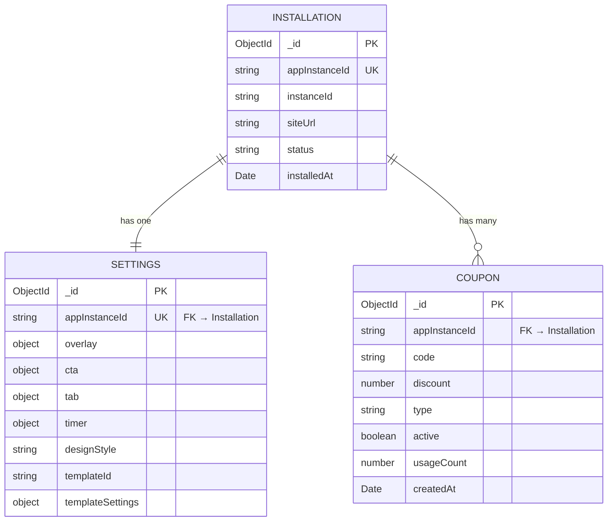

# Skill: Data Model

Модель данных: от entity definitions до query optimization.

**Разделы:**
1. [Входы](#1-входы)
2. [Entity Definition Template](#2-entity-template)
3. [ER Diagram](#3-er-diagram)
4. [Data Patterns](#4-data-patterns)
5. [Index Strategy](#5-indexes)
6. [Query Pattern Mapping](#6-query-mapping)
7. [Transactions](#7-transactions)
8. [Migrations](#8-migrations)
9. [Пример: полная модель](#9-пример)
10. [Output Template](#10-output)

---

## 1. Входы

| Вход | Откуда | Зачем |
|------|--------|-------|
| PRD | PM gate | Acceptance criteria → entities, constraints |
| UX Spec | UX gate | Screens/flows → query patterns |
| API Contracts | Architect | Request/Response → fields, types |
| NFR | System Design | Volume, latency, retention |

---

## 2. Entity Definition Template

Для каждой сущности:

```markdown
### Entity: Coupon

**Collection:** `coupons`
**Lifecycle:** Created by site owner, read by embedded script, deleted manually

| Field | Type | Required | Default | Constraints | Description |
|-------|------|----------|---------|-------------|-------------|
| _id | ObjectId | auto | auto | unique | Primary key |
| appInstanceId | string | ✅ | — | indexed | Installation reference |
| code | string | ✅ | — | 3-20 chars, uppercase, alphanumeric | Coupon code |
| discount | number | ✅ | — | 1-100 | Discount value |
| type | string | ✅ | "percent" | enum: percent, fixed | Discount type |
| active | boolean | ⬜ | true | — | Is coupon active |
| usageCount | number | ⬜ | 0 | min: 0 | Times used |
| createdAt | Date | auto | now | — | Timestamp |
| updatedAt | Date | auto | now | — | Timestamp |

**Unique constraints:** (appInstanceId, code)
**Indexes:** See Index Strategy
**Relationships:** belongs to Installation (via appInstanceId)
**Storage pattern:** Reference (separate collection)
**Rationale:** Coupons have independent lifecycle, unbounded per installation
```

---

## 3. ER Diagram



---

## 4. Data Patterns

### Embed vs Reference Decision

| Критерий | Embed ✅ | Reference ✅ |
|---------|---------|-------------|
| Читаются вместе | Да | Нет |
| Independent lifecycle | Нет | Да |
| Bounded size | Да (< 50 items) | Unbounded |
| Atomic updates child | Нужны | Не критично |

### Decision table (для проекта)

| Parent | Child | Pattern | Rationale |
|--------|-------|---------|-----------|
| Installation | Settings | **Embed** (или 1:1 ref) | Всегда читаются вместе, 1 settings per install |
| Installation | Coupons | **Reference** | Independent CRUD, unbounded, own pagination |
| Settings | overlay/cta/tab | **Embed** | Bounded subdocuments, always read together |

> Каждый выбор embed/reference = потенциальный ADR. Если неочевидно — создай `$adr_log`.

### Caching (если применимо)

| Data | Cache? | Strategy | TTL | Invalidation |
|------|--------|----------|-----|-------------|
| Widget config | ✅ | HTTP Cache-Control | 60s | PUT settings → purge |
| Coupon list | ⬜ | No cache (small, dashboard only) | — | — |
| Settings (dashboard) | ⬜ | No cache (always fresh) | — | — |

---

## 5. Index Strategy

### Index → Query Pattern Mapping

| Index | Fields | Type | Serves Query |
|-------|--------|------|-------------|
| `installations_appInstanceId` | `{ appInstanceId: 1 }` | unique | Lookup by appInstanceId |
| `settings_appInstanceId` | `{ appInstanceId: 1 }` | unique | Lookup settings by install |
| `coupons_app_code` | `{ appInstanceId: 1, code: 1 }` | unique | Duplicate check on create |
| `coupons_app_active_date` | `{ appInstanceId: 1, active: 1, createdAt: -1 }` | compound | List active coupons sorted by date |
| `coupons_app_date` | `{ appInstanceId: 1, createdAt: -1 }` | compound | List all coupons sorted |

### Index rules

| Правило | Описание |
|---------|---------|
| **ESR** | Equality → Sort → Range (порядок полей в compound) |
| **Max 5-7** | Каждый index = write overhead |
| **Verify** | `explain('executionStats')` → IXSCAN, не COLLSCAN |
| **Partial** | Если index нужен не для всех docs: `partialFilterExpression` |

---

## 6. Query Pattern Mapping

Маппинг UX screen → query:

| UX Screen | Action | Query | Index Used |
|-----------|--------|-------|------------|
| Dashboard: Coupons list | Load page | `find({ appInstanceId }).sort({ createdAt: -1 }).limit(20)` | `coupons_app_date` |
| Dashboard: Coupons list | Filter active | `find({ appInstanceId, active: true }).sort({ createdAt: -1 })` | `coupons_app_active_date` |
| Dashboard: Coupons list | Search by code | `find({ appInstanceId, code: { $regex } })` | `coupons_app_code` (prefix) |
| Dashboard: Settings | Load | `findOne({ appInstanceId })` | `settings_appInstanceId` |
| Dashboard: Settings | Save | `updateOne({ appInstanceId }, { $set: ... })` | `settings_appInstanceId` |
| Embedded Script | Load config | `findOne({ appInstanceId })` + `findOne({ appInstanceId, active: true }).sort({ createdAt: -1 })` | `settings_appInstanceId` + `coupons_app_active_date` |
| Webhook: install | Create | `updateOne({ appInstanceId }, { ... }, { upsert: true })` | `installations_appInstanceId` |

### Performance notes

| Query | Expected latency | Volume | Notes |
|-------|-----------------|--------|-------|
| Widget config | < 10ms | Every page view | Add cache header |
| Coupons list | < 20ms | Dashboard only | Paginated |
| Settings load | < 5ms | Dashboard only | Single doc |

---

## 7. Transactions

### Когда нужны

| Scenario | Transaction? | Rationale |
|----------|:---:|-----------|
| Create coupon | ⬜ No | Single collection write |
| Update settings | ⬜ No | Single document update |
| Apply coupon (if order system) | ✅ Yes | Multi-doc: update order + increment usage |
| Install webhook (upsert install + settings) | ⬜ No | Idempotent upserts, eventual consistency OK |

### Правило

> MongoDB любит моделирование, где транзакции нужны **редко**. Если транзакция нужна часто — пересмотри schema (может стоит embed).

---

## 8. Migrations

### Strategy

| Когда | Как |
|-------|-----|
| Новое поле (optional) | Добавить в schema + `$setOnInsert` default |
| Новое поле (required) | Migration script: `updateMany` + backfill |
| Rename field | Migration script + update code + period with both fields |
| Remove field | Migration script: `$unset` + remove from schema |
| Change type | Два шага: add new field → migrate data → remove old |

### Tool

```bash
npx migrate-mongo create add-templateId-to-settings
npx migrate-mongo up
npx migrate-mongo down   # rollback
npx migrate-mongo status
```

---

## 9. Пример: полная модель

```markdown
# Data Model: Smart Cart Rescue

## Entities
1. Installation — Wix app installation record
2. Settings — Widget configuration (1:1 with Installation)
3. Coupon — Discount coupons (1:N with Installation)

## Storage
- MongoDB 7 (single instance, Docker)
- Mongoose ODM (strict: 'throw')
- Timestamps on all collections

## Key decisions
- Settings embedded approach considered, but separate collection for independent API
- Coupons always referenced (unbounded, independent CRUD)
- See ADR-001 (MongoDB), ADR-003 (embed vs reference)
```

---

## 10. Output Template

```markdown
# Data Model: <project-name>

**Date:** YYYY-MM-DD
**Database:** MongoDB 7 + Mongoose

## ER Diagram
<mermaid diagram>

## Entities
<for each entity: section 2 template>

## Data Patterns
<embed vs ref decisions with rationale>

## Indexes
<section 5 table>

## Query Mapping
<section 6 table>

## Transactions
<section 7 table>

## Migration Strategy
<section 8>
```

---

## См. также
- `$api_contracts` — API endpoints (schemas match entity fields)
- `$mongodb_mongoose_best_practices` — implementation patterns
- `$architecture_doc` — Architecture Document (data model section)
- `$adr_log` — ADR for embed/reference/DB decisions
