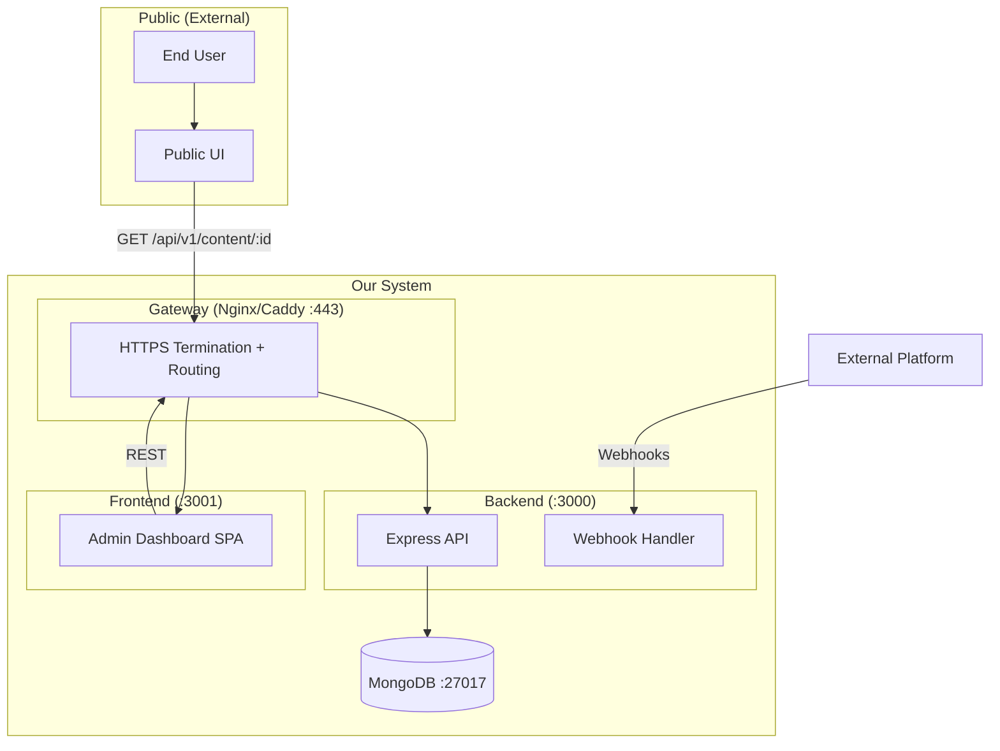

# Skill: Architecture Document

Полная архитектура системы — от overview до implementation plan.

**Разделы:**
1. [Входы](#входы)
2. [Структура документа](#структура) (11 секций)
3. [Примеры для каждой секции](#примеры)
4. [Quality Checklist](#quality-checklist)
5. [Red Flags](#red-flags)

---

## Входы

| Вход | Обязательный | Откуда |
|------|:---:|--------|
| PRD | ✅ | Product Manager gate |
| UX Spec | ✅ | UX/UI Designer gate |
| Current State Analysis | ⬜ опц. | `$current_state_analysis` |
| System Design Checklist | ⬜ опц. | `$system_design_checklist` |
| Ограничения стека/деплоя | ✅ | DevOps / team constraints |

---

## Структура документа

### 1) Overview

```markdown
## 1. Overview

### What we're building
<1 абзац: что строим, какую проблему решаем>

### Constraints
- Stack: React 18 + Vite (FE), Express 4 (BE), MongoDB 7 (DB)
- Deployment: Docker Compose + Nginx/Caddy
- Integration: <External platform if any>
- Timeline: 2 sprints (4 weeks)

### Assumptions
- Authentication handled via JWT / external provider
- Single MongoDB instance sufficient for MVP (< 10K users)
- Admin panel used by team members only (low concurrency)
```

---

### 2) System Context

```markdown
## 2. System Context

### Actors
| Actor | Type | Interaction |
|-------|------|-------------|
| Admin | Human | Dashboard: manages settings, content |
| End User | Human | Public UI: views content, interacts |
| External Platform | System | Webhooks, OAuth |

### External Integrations
| System | Protocol | Purpose |
|--------|----------|---------|
| External API | HTTPS | Data sync, webhooks |
| Auth Provider | OAuth 2.0 / JWT | User authentication |

### System Boundary
Dashboard + API + Public UI = our system.
External Platform + End User's Browser = external.
```

---

### 3) High-level Architecture Diagram



---

### 4) Modules / Components

Для каждого модуля заполни:

```markdown
## 4. Modules

### 4.1 API Server (Express)

| Аспект | Описание |
|--------|---------|
| **Responsibility** | REST API, webhook handling, auth |
| **NOT responsible for** | UI rendering, static files serving (reverse proxy does this) |
| **Public API** | See API Contracts doc |
| **Dependencies** | MongoDB (via Mongoose), External APIs |
| **Layers** | Router → Controller → Service → Repository |
| **Test boundary** | Unit: services (mock repos). Integration: repos + DB |

### 4.2 Admin Dashboard (React SPA)

| Аспект | Описание |
|--------|---------|
| **Responsibility** | Settings management, content CRUD, preview |
| **NOT responsible for** | Direct DB access, external API calls |
| **Public API** | N/A (user-facing UI) |
| **Dependencies** | API Server (REST) |
| **State** | Zustand (settings store, content store) |
| **Test boundary** | Unit: stores, utils. Integration: component render tests |

### 4.3 Public UI (optional)

| Аспект | Описание |
|--------|---------|
| **Responsibility** | Fetch config from API, render public-facing content |
| **NOT responsible for** | Settings management, data persistence |
| **Dependencies** | API Server (GET /content/:id) |
| **Test boundary** | Unit: render logic. E2E: browser test |
```

---

### 5) Flow Mapping

Маппинг UX flow → technical path:

```markdown
## 5. Flow Mapping

### Flow: Admin saves settings

| Step | UX | Frontend | API | Service | Repository | DB |
|------|-----|---------|-----|---------|------------|-----|
| 1 | Click "Save" | `PUT /api/v1/settings/:id` | `settingsRouter` | `configService.update()` | `configRepo.upsert()` | `settings.updateOne()` |
| 2 | See "Saved!" toast | Response 200 → toast | — | — | — | — |
| 3 | Preview updates | Re-fetch config | — | — | — | — |

**States:**
- Loading: spinner on Save button
- Error: toast "Failed to save" + retry
- Success: toast "Settings saved" + preview refresh

### Flow: End user views content

| Step | UX | Public UI | API | DB |
|------|-----|----------------|-----|-----|
| 1 | Page loads | Public UI bootstrap | — | — |
| 2 | — | `GET /api/v1/content/:id` | `contentController` | `settings.findOne()` + `items.findOne()` |
| 3 | Content appears | `renderContent(config)` | — | — |
| 4 | Click CTA | Execute action | — | — |
```

---

### 6) Integration Patterns

```markdown
## 6. Integration Patterns

| Integration | Pattern | Timeout | Retry | Idempotent |
|------------|---------|---------|-------|------------|
| Install Webhook | Async POST → process | 10s | No (platform retries) | Yes (upsert) |
| External API | Sync POST | 5s | 2x with backoff | Yes |
| Public Content Fetch | Sync GET | 3s | No (fail gracefully) | N/A (read) |
| Admin REST | Sync CRUD | 5s | No (user retries) | PUT = idempotent |
```

---

### 7) Error Handling Strategy

```markdown
## 7. Error Handling

### Error format (API response)
\`\`\`json
{
  "error": {
    "code": "VALIDATION_ERROR",
    "message": "Invalid product name",
    "details": [{ "field": "name", "message": "Must be 3-100 chars" }]
  }
}
\`\`\`

### Mapping
| Domain Error | HTTP | Code | UI Message | Log |
|-------------|------|------|-----------|-----|
| Validation | 400 | VALIDATION_ERROR | Field-level errors | warn |
| Not Found | 404 | NOT_FOUND | "Not found" | info |
| Duplicate | 409 | DUPLICATE | "Already exists" | warn |
| Auth | 401 | UNAUTHORIZED | "Please log in" | warn |
| Forbidden | 403 | FORBIDDEN | "Access denied" | warn |
| Internal | 500 | INTERNAL_ERROR | "Something went wrong" | error |

### Rule: never expose
- Stack traces
- DB error messages
- Internal paths
- Secret values
```

---

### 8) Testing Strategy

```markdown
## 8. Testing Strategy

| Layer | What | Tool | Mock |
|-------|------|------|------|
| Unit | Services, utils, validators | Vitest | Repos, external APIs |
| Integration | API endpoints, DB queries | Vitest + MongoMemoryServer | External APIs |
| Component | React components | Vitest + RTL | API calls (msw) |
| E2E | Critical flows | Browser agent / Playwright | Nothing |

### Must-have scenarios
- [ ] CRUD settings (happy path + validation errors)
- [ ] CRUD items (happy path + duplicate)
- [ ] Public content endpoint returns correct payload
- [ ] Install webhook creates installation + settings
- [ ] Public UI renders from API payload
```

---

### 9) Scalability Bottlenecks

```markdown
## 9. Scalability Bottlenecks

| Bottleneck | Current | When it hurts | Mitigation |
|-----------|---------|---------------|------------|
| No DB indexes | Collection scan | > 1K docs | Add compound indexes |
| Content fetch on every pageview | API load | > 100 rps | Cache-Control + CDN |
| Single MongoDB | Write throughput | > 10K writes/s | Replica set |
| Sync processing in webhook | Webhook timeout | Many installs | Background job |
| No connection pooling | Connection storms | > 50 concurrent | maxPoolSize config |
```

---

### 10) Growth Plan

```markdown
## 10. Growth Plan

| Scale | Architecture | Changes needed |
|-------|-------------|----------------|
| **< 1K users** | Current: monolith + single Mongo | None |
| **1K – 10K** | Add indexes, connection pooling, cache | ARCH-xx |
| **10K – 100K** | Replica set, CDN for public content, Redis cache | ARCH-xx |
| **100K – 1M** | Separate API from webhook processing, queue | ARCH-xx |
| **> 1M** | Microservices, sharding, multi-region | Full redesign |
```

---

### 11) Implementation Plan

```markdown
## 11. Implementation Plan

### Phase 1: Foundation (Sprint 1)
| # | Task | Dependencies | Estimate |
|---|------|-------------|----------|
| 1 | DB schemas + migrations | None | 2h |
| 2 | API: CRUD settings | #1 | 4h |
| 3 | API: CRUD items | #1 | 4h |
| 4 | API: Widget endpoint | #1 | 2h |
| 5 | Webhook handler | #1 | 3h |

### Phase 2: Frontend (Sprint 1-2)
| # | Task | Dependencies | Estimate |
|---|------|-------------|----------|
| 6 | Dashboard: Settings page | #2 | 6h |
| 7 | Dashboard: Item management | #3 | 4h |
| 8 | Dashboard: Live Preview | #4, #6 | 4h |

### Phase 3: Integration (Sprint 2)
| # | Task | Dependencies | Estimate |
|---|------|-------------|----------|
| 9 | Public UI | #4 | 6h |
| 10 | External platform integration | #5, #9 | 3h |
| 11 | E2E testing | All | 4h |

### Dependency graph
\`\`\`
#1 → #2 → #6
#1 → #3 → #7
#1 → #4 → #8, #9
#1 → #5 → #10
#6 + #4 → #8
#9 + #5 → #10
All → #11
\`\`\`
```

---

## Quality Checklist

| # | Check | Status |
|---|-------|--------|
| 1 | Любой UX flow трассируется через modules → API → DB | ☐ |
| 2 | Границы модулей снижают связность (no circular deps) | ☐ |
| 3 | Тестируемость заложена (mock boundaries defined) | ☐ |
| 4 | Error handling единообразен (format + mapping) | ☐ |
| 5 | Наблюдаемость запланирована (logs, health checks) | ☐ |
| 6 | Deployment strategy определена | ☐ |
| 7 | Growth plan есть (хотя бы 3 порога) | ☐ |
| 8 | Implementation plan с зависимостями | ☐ |

---

## Red Flags

| Flag | Описание | Обнаружение |
|------|---------|-------------|
| Big Ball of Mud | Нет чёткой архитектуры | Нет разделения слоёв |
| Golden Hammer | Одно решение для всех задач | "MongoDB for everything" |
| Premature Optimization | Оптимизация без данных | Cache/sharding до первого пользователя |
| Not Invented Here | Отказ от готовых решений | Custom auth, custom ORM |
| Analysis Paralysis | Бесконечное планирование | 3+ альтернативы без решения |
| Magic | Неочевидное поведение | Hooks с бизнес-логикой |
| Tight Coupling | Высокая связность | Изменение модуля ломает другие |
| God Object | Один компонент делает всё | Файл > 500 строк |

---

## Deliverables

| Артефакт | Формат | Где сохранять |
|---------|--------|---------------|
| Architecture Document | Markdown (11 sections above) | `docs/architecture/architecture.md` |
| Architecture Diagram | Mermaid в документе | inline |
| ADR records | `$adr_log` формат | `docs/architecture/adr/` |

---

## См. также
- `$current_state_analysis` — аудит перед новой архитектурой
- `$system_design_checklist` — quick check полноты
- `$adr_log` — фиксация решений
- `$api_contracts` — детальные API контракты
- `$data_model` — детальная data model