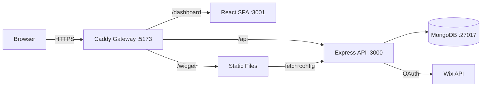

# Skill: System Design Checklist

Самопроверка полноты архитектуры перед передачей в разработку.

**Разделы:**
1. [Functional Requirements](#1-functional-requirements)
2. [Non-Functional Requirements](#2-nfr)
3. [Technical Design](#3-technical-design)
4. [Data Layer](#4-data-layer)
5. [Security](#5-security)
6. [Operations](#6-operations)
7. [Red Flags](#7-red-flags)
8. [Output Template](#8-output)

---

## 1. Functional Requirements

| # | Check | Guidance | Status |
|---|-------|---------|--------|
| 1.1 | User stories документированы | Формат: "As a [user], I want [action], so that [value]". Минимум для MVP scope | ☐ |
| 1.2 | UI/UX flows промаплены | Каждый screen → actions → outcomes. Включая loading/error/empty states | ☐ |
| 1.3 | API контракты определены | Endpoints, methods, request/response schemas, status codes. Формат: OpenAPI или markdown table | ☐ |
| 1.4 | Data models определены | Entities, relationships, constraints. Формат: ER diagram (mermaid) или schema definitions | ☐ |
| 1.5 | Edge cases покрыты | Что если: пустые данные, concurrent updates, partial failures, expired tokens | ☐ |

### Пример PASS

```
1.3 API контракты: ✅ PASS
  POST /api/v1/products — CreateProductRequest → ProductResponse (201)
  GET /api/v1/products/:id — → ProductResponse (200) | ErrorResponse (404)
  Schemas определены в docs/api-contracts.md
```

### Пример MISSING

```
1.5 Edge cases: ❌ MISSING
  Не определено поведение при:
  - Concurrent update settings (optimistic locking?)
  - Expired item на storefront (показывать expired или скрывать?)
  → Рекомендация: добавить acceptance criteria в PRD
  → Task: ARCH-05
```

---

## 2. Non-Functional Requirements

| # | Check | Guidance | Status |
|---|-------|---------|--------|
| 2.1 | Performance targets | p95 latency ≤ X ms, throughput ≥ Y rps. Для каждого критического endpoint | ☐ |
| 2.2 | Scalability | Ожидаемая нагрузка (users, requests, data volume). Growth plan (x10, x100) | ☐ |
| 2.3 | Availability | Uptime target (99.9%?). Допустимый downtime. Graceful degradation strategy | ☐ |
| 2.4 | Security | Auth/authz model, data classification, compliance requirements (GDPR, PCI) | ☐ |
| 2.5 | Observability | Logging, metrics, alerting, tracing requirements | ☐ |

### Guidance: Performance targets

```markdown
## Performance Targets

| Endpoint | p50 | p95 | p99 | Max concurrent |
|----------|-----|-----|-----|----------------|
| GET /api/v1/widget/:id | 50ms | 100ms | 200ms | 100 |
| POST /api/v1/settings | 100ms | 200ms | 500ms | 20 |
| Dashboard page load | 1s | 2s | 3s | 50 |

Измерение: response time от gateway, без network latency.
```

---

## 3. Technical Design

| # | Check | Guidance | Status |
|---|-------|---------|--------|
| 3.1 | Architecture diagram | Текстовая (mermaid/ASCII). Показывает: компоненты, потоки данных, границы | ☐ |
| 3.2 | Component responsibilities | Для каждого: что делает, что НЕ делает, public API, зависимости | ☐ |
| 3.3 | Data flow | Request path: client → gateway → API → service → repo → DB → response | ☐ |
| 3.4 | Integration points | Внешние системы (Wix API, payment, email). Retry/timeout/circuit breaker стратегия | ☐ |
| 3.5 | Error handling | Единый формат ошибок. Mapping: domain errors → HTTP codes → UI messages | ☐ |
| 3.6 | Testing strategy | Unit/integration/e2e границы. Coverage targets. What to mock | ☐ |

### Пример: Architecture diagram (mermaid)



### Пример: Error handling table

| Domain Error | HTTP Code | UI Message | Log Level |
|-------------|-----------|-----------|-----------|
| ValidationError | 400 | "Check your input" + field details | warn |
| NotFoundError | 404 | "Not found" | info |
| DuplicateError | 409 | "Already exists" | warn |
| AuthError | 401 | "Please log in" | warn |
| InternalError | 500 | "Something went wrong" | error |

---

## 4. Data Layer

| # | Check | Guidance | Status |
|---|-------|---------|--------|
| 4.1 | Schema definitions | Mongoose schemas с validators, defaults, timestamps | ☐ |
| 4.2 | Embed vs Reference | Осознанный выбор, задокументирован в ADR | ☐ |
| 4.3 | Indexes | Compound indexes под ключевые query patterns. Проверено через explain() | ☐ |
| 4.4 | Pagination | Cursor для больших коллекций, skip для маленьких | ☐ |
| 4.5 | Migrations | migrate-mongo или аналог. Backfill strategy для schema changes | ☐ |

---

## 5. Security

| # | Check | Guidance | Status |
|---|-------|---------|--------|
| 5.1 | Input validation | Zod schemas на каждый endpoint. Whitelist approach | ☐ |
| 5.2 | Auth/Authz | JWT/session strategy. Authorization before data access | ☐ |
| 5.3 | Secrets management | Env vars only. .env.example без значений. gitignore | ☐ |
| 5.4 | Secure headers | Helmet, CORS whitelist, CSP | ☐ |
| 5.5 | Dependency audit | `npm audit`, lockfile committed, no known vulnerabilities | ☐ |

---

## 6. Operations

| # | Check | Guidance | Status |
|---|-------|---------|--------|
| 6.1 | Deployment | Docker Compose / K8s. Build → test → deploy pipeline | ☐ |
| 6.2 | Health checks | `/health/live` + `/health/ready` endpoints | ☐ |
| 6.3 | Monitoring | Structured logs (pino). Key metrics: latency, error rate, throughput | ☐ |
| 6.4 | Alerting | Error rate > X% → alert. p95 latency > Yms → alert | ☐ |
| 6.5 | Backup/Recovery | DB backup strategy. RPO/RTO определены | ☐ |
| 6.6 | Rollback plan | Как откатить: previous Docker image, DB migration down, feature flag | ☐ |

---

## 7. Red Flags

| # | Flag | Что это | Как обнаружить |
|---|------|---------|---------------|
| 7.1 | Big Ball of Mud | Нет чёткой архитектуры, всё связано со всем | Нет слоёв, circular deps |
| 7.2 | God Object | Один файл/класс делает всё | Файл > 500 строк, > 10 methods |
| 7.3 | Tight Coupling | Изменение одного модуля ломает другие | Нет interfaces/contracts между слоями |
| 7.4 | Magic | Неочевидное поведение без документации | Mongoose hooks с бизнес-логикой, implicit globals |
| 7.5 | Analysis Paralysis | Бесконечное планирование | Нет MVP пути, 3+ альтернативы без решения |
| 7.6 | Premature Optimization | Оптимизация без данных | Cache/sharding до первого пользователя |
| 7.7 | Not Invented Here | Отказ от готовых решений | Custom auth, custom ORM, custom logger |

---

## 8. Output

```markdown
# System Design Checklist: <feature/project>

**Date:** YYYY-MM-DD
**Reviewer:** Architect Agent

## Results

| Section | Pass | Missing | Total |
|---------|------|---------|-------|
| Functional | 4 | 1 | 5 |
| NFR | 3 | 2 | 5 |
| Technical | 5 | 1 | 6 |
| Data | 4 | 1 | 5 |
| Security | 5 | 0 | 5 |
| Operations | 4 | 2 | 6 |
| Red Flags | 6 | 1 | 7 |
| **Total** | **31** | **8** | **39** |

## Missing Items

| # | Check | Severity | Recommendation | Task |
|---|-------|----------|----------------|------|
| 2.1 | Performance targets | 🟠 P1 | Define p95 targets for critical endpoints | ARCH-12 |
| 6.4 | Alerting | 🟡 P2 | Set up basic alerts after MVP | ARCH-15 |

## Verdict
✅ READY for development (with noted ARCH-xx items tracked)
⚠️ CONDITIONAL — must address P0/P1 items before dev
❌ NOT READY — significant gaps in <section>
```

---

## См. также
- `$current_state_analysis` — аудит текущего состояния (перед этим checklist)
- `$architecture_doc` — полный Architecture Document (после checklist)
- `$adr_log` — фиксация решений
- `$security_baseline_dev` — детальная security проверка
