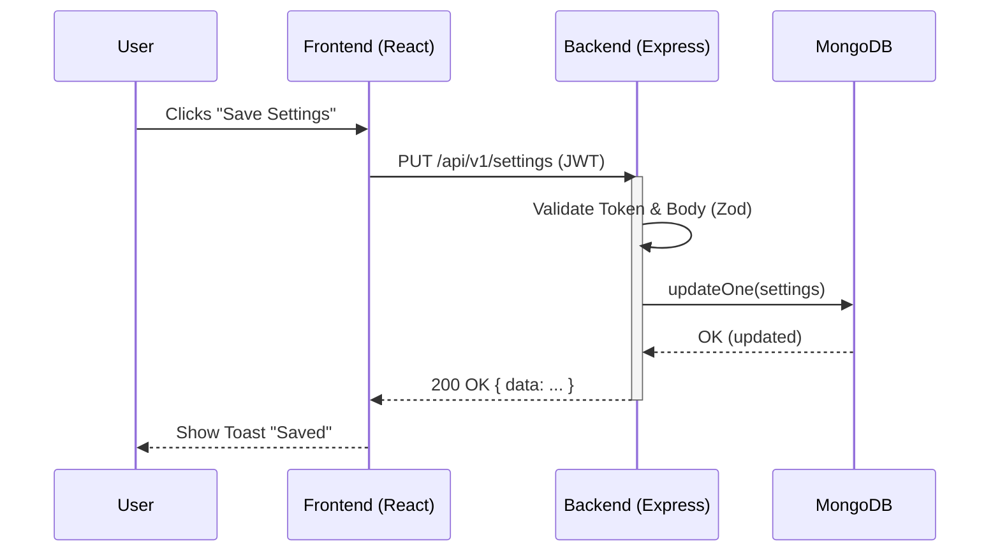

# Skill: Architecture Document

Create an architectural document based on PRD and UX Spec.

**Sections:**
1. [General rules](#1-general-rules)
2. [Document Structure](#2-document-structure)
3. [Component Diagram](#3-component-diagram)
4. [Data Flow (Sequence)](#4-data-flow)
5. [Anti-patterns](#5-anti-patterns)
6. [Output Template](#6-output)

---

## 1. General rules

| Rule | Convention |
|---------|-----------|
| **Goal** | Connect "what" (PRD) with "how" (code) |
| **Audience** | Full Stack, DevOps, Reviewer, PM |
| **Format** | Markdown with Mermaid diagrams |
| **Dependencies** | Must reference PRD, UX, ADRs, Contracts |
| **Scope** | Complete system (frontend, backend, DB, external) |
| **Update frequency** | Living document; update when architecture changes |

---

## 2. Document Structure

### 2.1 System Overview
- **Vision:** 1-2 sentence summary of the technical solution.
- **Constraints:** Hard limits (e.g., "Must run in Wix iframe", "PostgreSQL only", "Max 100ms latency").
- **Key metrics NFRs:** Scale targets (req/sec, # of users), availability (99.9%).

### 2.2 Component Architecture
- **Web Client (Frontend):** Framework (React), layout, state management (Zustand/RTK), routing.
- **API Gateway / Backend:** Framework (Express/Go), auth layer, core modules.
- **Data Layer:** DBMS, caching, object storage.
- **External Integrations:** Wix API, Email provider, Payment gateway.
- *(Include Mermaid Component Diagram here)*

### 2.3 Core Modules
Describe each logical module (e.g., Auth, Billing, Products):
- **Responsibility:** What it does.
- **Dependencies:** What it calls.
- **Data:** Key entities it owns.

### 2.4 Data Architecture
- **Schema Overview:** Key collections/tables (link to full Data Model).
- **Storage Strategy:** Where data lives (MongoDB Atlas, local SQLite for dev).
- **Caching Strategy:** Redis? In-memory? Browser cache?

### 2.5 Key User Flows (Sequence)
- Describe 2-3 critical paths (e.g., "User Login & Dashboard Load", "Purchase Flow").
- *(Include Mermaid Sequence Diagram here)*

### 2.6 Cross-Cutting Concerns
- **Authentication & Authorization:** JWT vs Session, Role-Based Access Control (RBAC).
- **Error Handling:** Global error format, retry strategies.
- **Observability:** Logging (Pino), metrics, tracing (trace_id).
- **Security:** CSRF, XSS, rate limiting, secrets management.

### 2.7 Deployment & Infrastructure
- **Environments:** Dev, Staging, Prod.
- **Hosting:** Vercel (FE) + Render (BE) vs Custom K8s cluster.
- **CI/CD:** GitHub Actions (lint → test → build → deploy).

### 2.8 Risks & Technical Debt
- **Known bottlenecks:** "Search uses regex, will be slow at 100k records."
- **Planned tech debt:** "Skipping Redis cache for MVP."
- **Mitigation:** "Will migrate to Elasticsearch when hitting 50k users."

---

## 3. Component Diagram

Use Mermaid for visualizing system boundaries:

```mermaid
graph TD
    Client[Web Browser (React)]
    API[Backend API (Node.js)]
    DB[(Database (MongoDB))]
    Ext[External API (Wix)]
    Cache[(Cache (Redis))]

    Client -- HTTPS --> API
    API -- Mongoose --> DB
    API -- REST --> Ext
    API -- ioredis --> Cache
```

<br>

*Rules for diagrams:*
- Keep them simple (max 10-15 nodes).
- Group related components (subgraphs).
- Label connections with protocols (HTTPS, REST) or tools (Mongoose).

---

## 4. Data Flow (Sequence)

Use Mermaid for critical flows:



<br>

*Rules for sequence diagrams:*
- Show happy path + 1 major error path (if critical).
- clearly show `activate`/`deactivate` blocks.
- Label arrows with meaningful actions/endpoints.

---

## 5. Anti-patterns

| ❌ Anti-pattern | ✅ Solution |
|----------------|-----------|
| **Too detailed** | Document high-level architecture, not every function. |
| **No diagrams** | Text describes, diagrams visualize. Always use Mermaid. |
| **Ignoring NFRs** | Explicitly mention performance, security, and scale constraints. |
| **Orphaned document** | Link to PRD, UX Specs, ADRs, and API Contracts. |
| **"We'll figure it out later"** | If undetermined, explicitly list as "Open Question" or "Risk". |

---

## 6. Output Template

```markdown
# Architecture Document: <Project Name>

**Date:** YYYY-MM-DD
**Version:** v1.0
**Status:** Draft | Approved

## 1. System Overview
<Vision and NFR constraints>

## 2. Component Architecture
<Mermaid graph>
- Web Client: ...
- Backend API: ...
- Database: ...

## 3. Core Modules
- Module A: ...
- Module B: ...

## 4. Key User Flows
<Mermaid sequence diagram for primary flow>

## 5. Data Architecture
<High-level schema, storage, caching>

## 6. Cross-Cutting Concerns
- Auth: ...
- Observability: ...
- Error Handling: ...

## 7. Deployment & Infrastructure
<Hosting, CI/CD pipeline overview>

## 8. Risks & Mitigations
| Risk | Impact | Mitigation |
|------|--------|------------|
| ... | ... | ... |

---
**References:**
- [PRD](./prd.md)
- [ADR Index](./adr/README.md)
- [API Contracts](./api-contracts.md)
```

---

## See also
- `$current-state-analysis` — before architecture changes
- `$adr-log` — detailed architectural decisions
- `$data-model` — complete DB schema
- `$deployment-ci-plan` — specific execution plan
