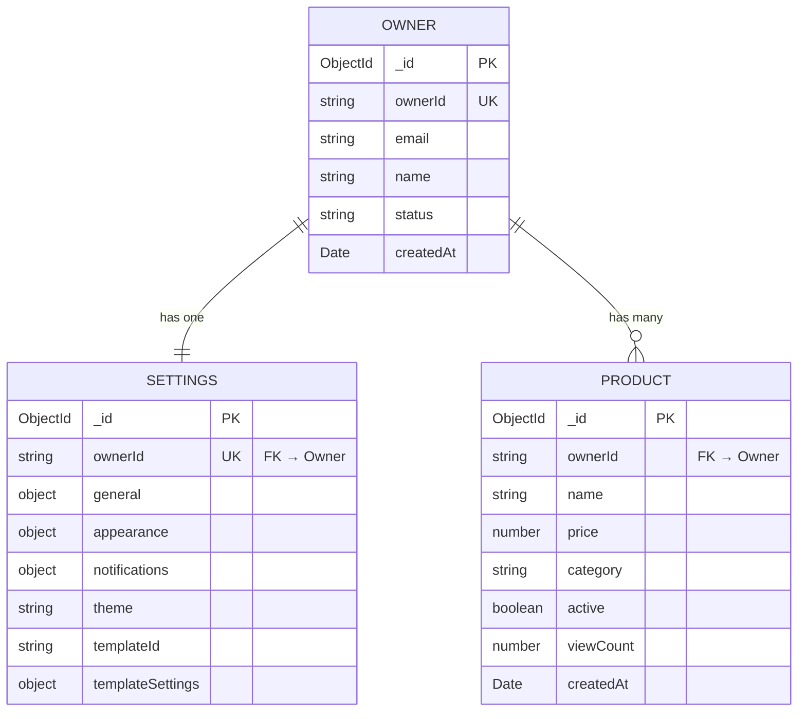

# Skill: Data Model

Data model: from entity definitions to query optimization.

**Sections:**
1. [Inputs](#1-inputs)
2. [Entity Definition Template](#2-entity-definition-template)
3. [ER Diagram](#3-er-diagram)
4. [Data Patterns](#4-data-patterns)
5. [Index Strategy](#5-index-strategy)
6. [Query Pattern Mapping](#6-query-pattern-mapping)
7. [Transactions](#7-transactions)
8. [Migrations](#8-migrations)
9. [Example: full model](#9-example-full-model)
10. [Output Template](#10-output-template)

---

## 1. Inputs

| Input | From where | What for |
|------|--------|-------|
| PRD | PM gate | Acceptance criteria → entities, constraints |
| UX Spec | UX gate | Screens/flows → query patterns |
| API Contracts | Architect | Request/Response → fields, types |
| NFR | System Design | Volume, latency, retention |

---

## 2. Entity Definition Template

For each entity:

```markdown
### Entity: Product

**Collection:** `products`
**Lifecycle:** Created by admin, read by public endpoint, deleted manually

| Field | Type | Required | Default | Constraints | Description |
|-------|------|----------|---------|-------------|-------------|
| _id | ObjectId | auto | auto | unique | Primary key |
| ownerId | string | ✅ | — | indexed | Owner/tenant reference |
| name | string | ✅ | — | 3-100 chars | Product name |
| price | number | ✅ | — | min: 0 | Product price |
| category | string | ✅ | "general" | enum: general, premium, sale | Product category |
| active | boolean | ⬜ | true | — | Is product visible |
| viewCount | number | ⬜ | 0 | min: 0 | Times viewed |
| createdAt | Date | auto | now | — | Timestamp |
| updatedAt | Date | auto | now | — | Timestamp |

**Unique constraints:** (ownerId, name)
**Indexes:** See Index Strategy
**Relationships:** belongs to Owner (via ownerId)
**Storage pattern:** Reference (separate collection)
**Rationale:** Products have independent lifecycle, unbounded per owner
```

---

## 3. ER Diagram



---

## 4. Data Patterns

### Embed vs Reference Decision

| Criterion | Embed ✅ | Reference ✅ |
|---------|---------|-------------|
| Read together | Yes | No |
| Independent lifecycle | No | Yes |
| Bounded size | Yes (< 50 items) | Unbounded |
| Atomic updates child | Needed | Not critical |

### Decision table (for the project)

| Parent | Child | Pattern | Rationale |
|--------|-------|---------|-----------|
| Owner | Settings | **Embed** (or 1:1 ref) | Always read together, 1 settings per owner |
| Owner | Products | **Reference** | Independent CRUD, unbounded, own pagination |
| Settings | general/appearance/notifications | **Embed** | Bounded subdocuments, always read together |

> Every embed/reference choice = potential ADR. If not obvious — create an `$adr-log`.

### Caching (if applicable)

| Data | Cache? | Strategy | TTL | Invalidation |
|------|--------|----------|-----|--------------|
| Public content | ✅ | HTTP Cache-Control | 60s | PUT settings → purge |
| Product list | ⬜ | No cache (small, dashboard only) | — | — |
| Settings (dashboard) | ⬜ | No cache (always fresh) | — | — |

---

## 5. Index Strategy

### Index → Query Pattern Mapping

| Index | Fields | Type | Serves Query |
|-------|--------|------|-------------|
| `owners_ownerId` | `{ ownerId: 1 }` | unique | Lookup by ownerId |
| `settings_ownerId` | `{ ownerId: 1 }` | unique | Lookup settings by owner |
| `products_owner_name` | `{ ownerId: 1, name: 1 }` | unique | Duplicate check on create |
| `products_owner_active_date` | `{ ownerId: 1, active: 1, createdAt: -1 }` | compound | List active products sorted by date |
| `products_owner_date` | `{ ownerId: 1, createdAt: -1 }` | compound | List all products sorted |

### Index rules

| Rule | Description |
|---------|---------|
| **ESR** | Equality → Sort → Range (order of fields in compound) |
| **Max 5-7** | Every index = write overhead |
| **Verify** | `explain('executionStats')` → IXSCAN, not COLLSCAN |
| **Partial** | If the index is not needed for all docs: `partialFilterExpression` |

---

## 6. Query Pattern Mapping

Mapping UX screen → query:

| UX Screen | Action | Query | Index Used |
|-----------|--------|-------|------------|
| Dashboard: Products list | Load page | `find({ ownerId }).sort({ createdAt: -1 }).limit(20)` | `products_owner_date` |
| Dashboard: Products list | Filter active | `find({ ownerId, active: true }).sort({ createdAt: -1 })` | `products_owner_active_date` |
| Dashboard: Products list | Search by name | `find({ ownerId, name: { $regex } })` | `products_owner_name` (prefix) |
| Dashboard: Settings | Load | `findOne({ ownerId })` | `settings_ownerId` |
| Dashboard: Settings | Save | `updateOne({ ownerId }, { $set: ... })` | `settings_ownerId` |
| Public Content | Load config | `findOne({ ownerId })` + `findOne({ ownerId, active: true }).sort({ createdAt: -1 })` | `settings_ownerId` + `products_owner_active_date` |
| Webhook: register | Create | `updateOne({ ownerId }, { ... }, { upsert: true })` | `owners_ownerId` |

### Performance notes

| Query | Expected latency | Volume | Notes |
|-------|-----------------|--------|-------|
| Public content | < 10ms | Every page view | Add cache header |
| Products list | < 20ms | Dashboard only | Paginated |
| Settings load | < 5ms | Dashboard only | Single doc |

---

## 7. Transactions

### When needed

| Scenario | Transaction? | Rationale |
|----------|:---:|-----------|
| Create product | ⬜ No | Single collection write |
| Update settings | ⬜ No | Single document update |
| Process order (if order system) | ✅ Yes | Multi-doc: update order + decrement stock |
| Register webhook (upsert owner + settings) | ⬜ No | Idempotent upserts, eventual consistency OK |

### Rule

> MongoDB likes modeling where transactions are needed **rarely**. If a transaction is needed often — reconsider the schema (maybe you should embed).

---

## 8. Migrations

### Strategy

| When | How |
|-------|-----|
| New field (optional) | Add to schema + `$setOnInsert` default |
| New field (required) | Migration script: `updateMany` + backfill |
| Rename field | Migration script + update code + period with both fields |
| Remove field | Migration script: `$unset` + remove from schema |
| Change type | Two steps: add new field → migrate data → remove old |

### Tool

```bash
npx migrate-mongo create add-templateId-to-settings
npx migrate-mongo up
npx migrate-mongo down   # rollback
npx migrate-mongo status
```

---

## 9. Example: full model

```markdown
# Data Model: SaaS Admin Panel

## Entities
1. Owner — registered account/tenant record
2. Settings — Application configuration (1:1 with Owner)
3. Product — Content items (1:N with Owner)

## Storage
- MongoDB 7 (single instance, Docker)
- Mongoose ODM (strict: 'throw')
- Timestamps on all collections

## Key decisions
- Settings embedded approach considered, but separate collection for independent API
- Products always referenced (unbounded, independent CRUD)
- See ADR-001 (MongoDB), ADR-003 (embed vs reference)
```

---

## 10. Output Template

```markdown
# Data Model: <project-name>

**Date:** YYYY-MM-DD
**Database:** MongoDB 7 + Mongoose

## ER Diagram
<mermaid diagram>

## Entities
<for each entity: section 2 template>

## Data Patterns
<embed vs ref decisions with rationale>

## Indexes
<section 5 table>

## Query Mapping
<section 6 table>

## Transactions
<section 7 table>

## Migration Strategy
<section 8>
```

---

## See also
- `$api-contracts` — API endpoints (schemas match entity fields)
- `$mongodb-mongoose-best-practices` — implementation patterns
- `$architecture-doc` — Architecture Document (data model section)
- `$adr-log` — ADR for embed/reference/DB decisions
