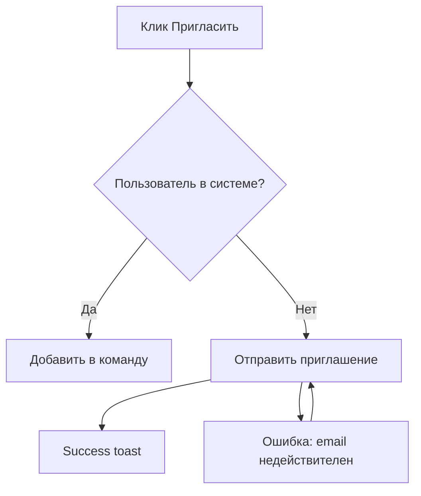
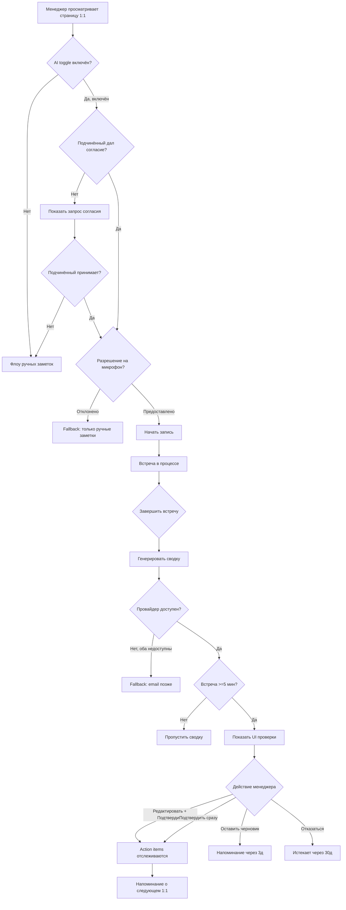

# User Flow

> **Категория:** UX  ·  **Slug:** `user-flow`

## Когда использовать

- Для каждого non-trivial multi-step flow в PRD.
- Перед дизайном — flows align команду на happy path + edges.
- В specification — flows маппятся на user stories.
- Для onboarding / activation анализа — identify drop-off points.

## Вход

| Поле | Обязательно | Описание |
|------|:-----------:|----------|
| User story / PRD | ✅ | Что flow должен реализовать |
| User persona | ✅ | Для кого |
| Entry points | ✅ | Откуда пользователь попадает в flow |
| Exit points | ✅ | Успех vs отказ vs ошибки |
| Существующий flow (при изменении) | ⬚ | Ссылка на текущее состояние |

## Источники данных

1. User interviews — как делают сейчас.
2. Product analytics — данные drop-off для существующих flows.
3. Support tickets — точки боли.
4. Flows конкурентов — базовые ожидания.

### Связь с другими скилами

| Скил | Что берём | Когда вызывать |
|------|-----------|----------------|
| `user-story` | Stories → flow segments | Parent concept |
| `acceptance-criteria` | AC — edge / error cases in flow | После flow |
| `design-brief` | Flow input для design | Перед brief |
| `jtbd-canvas` | Job context для flow trigger | Для understanding entry |

## Типы Flows

1. **Task flow** — линейный путь (создание аккаунта, отправка формы)
2. **Decision flow** — разветвлённый (онбординг в зависимости от роли)
3. **Error flow** — что происходит при ошибках
4. **Recovery flow** — как пользователь возвращается на путь

## Структура User Flow Doc

1. **Название и назначение flow**
2. **Actors** — кто использует этот flow
3. **Preconditions** — состояние, необходимое для входа
4. **Entry points** — откуда прибывает пользователь
5. **Happy path** — шаг за шагом
6. **Decision points** — ветвление
7. **Error states** — каждый режим отказа
8. **Exit points** — успех, отказ, ошибка
9. **Metrics** — что будем измерять

## Протокол

### Шаг 0 — Определение границ

- Вход: откуда user flow начинается (signup CTA, клик по навигации, ссылка из email)
- Выход: где заканчивается (состояние успеха, ошибка, abandonment)
- Preconditions: состояние авторизации, разрешения, состояние данных

### Шаг 1 — Happy Path (последовательные шаги)

Линейная последовательность от входа до успешного выхода. Шаги — видимые пользователю действия + ответы системы.

Нотация:
- **→** последовательный шаг
- **[Действие]** действие пользователя
- **(Система)** ответ системы
- **{Данные}** изменение состояния

Пример:
```
[Клик «Пригласить участника»] → 
(Открывается модальное окно с полем email) →
[Ввести email + назначить роль] →
[Клик «Отправить приглашение»] →
{Запись приглашения создана} →
(Email отправлен получателю) →
(Success toast: «Invite sent») →
Выход: приглашение ожидает ответа
```

### Шаг 2 — Decision Points

Где flow ветвится в зависимости от:
- Ввода пользователя (выбор роли, выбор плана)
- Состояния системы (доступность фичи, квота)
- Данных (существующий пользователь vs новый, разрешения)

Диаграмма: использовать операторы if/else или case:

```
После [Ввод email]:
  IF email — существующий пользователь:
    → Шаг: флоу существующего пользователя (добавить в команду)
  ELIF домен email заблокирован политикой:
    → Ошибка: «Domain not allowed by your org»
  ELSE:
    → Продолжить: флоу приглашения нового пользователя
```

### Шаг 3 — Error States

Для каждого системного режима отказа:
- **Триггер** — что вызывает
- **Сообщение, видимое пользователю** — точный текст
- **Действие по восстановлению** — что пользователь может сделать
- **Состояние системы** — залогировано? повторяется?

Частые ошибки:
- Сбой сети
- Ошибка валидации
- Доступ запрещён
- Квота исчерпана
- Сторонняя интеграция недоступна
- Устаревшие данные / одновременное изменение

### Шаг 4 — Empty / Loading States

- **Empty state:** пользователь впервые, данных ещё нет. Что они видят?
- **Loading state:** что во время сетевых вызовов?
- **Partial state:** часть данных загружена, часть загружается?

### Шаг 5 — Exit Points

Категоризировать все выходы:
- **Успех:** задача выполнена
- **Намеренный отказ:** пользователь отменил
- **Неявный отказ:** пользователь ушёл без действия (таймаут сессии, закрыл вкладку)
- **Сбой:** жёсткая ошибка, невосстановимая

Для каждого выхода:
- Что происходит в системе
- Что чувствует пользователь
- Может ли он снова войти в flow?

### Шаг 6 — Metrics Instrumentation

На каждый шаг flow:
- **Название события** (например, `invite_modal_opened`, `invite_sent_success`)
- **Свойства** (роль, источник и т.д.)
- **Воронка конверсии** — коэффициент от начала до успеха
- **Drop-off на каждом шаге**

Это подаётся в AARRR + success metrics.

### Шаг 7 — Визуализация

Варианты:
- **ASCII-диаграмма** (для текстовых документов)
- **Mermaid** (GitHub рендерит inline)
- **Figma / Whimsical / Miro** (для презентаций)

Пример Mermaid:


## Валидация (Quality Gate)

- [ ] Entry + exit points явны
- [ ] Preconditions перечислены
- [ ] Happy path шаг за шагом
- [ ] ≥ 2 decision points (кроме тривиально линейных)
- [ ] ≥ 3 error states с recovery
- [ ] Empty / loading states покрыты
- [ ] Все выходы категоризированы (success / abandon / fail)
- [ ] Metric events определены на каждый шаг
- [ ] Визуализировано (диаграмма)

## Handoff

Результат является входом для:
- **`design-brief`** → flow → необходимые экраны
- **UX Designer** → вайрфреймы на каждый шаг
- **Engineering** → дизайн API для каждого действия
- **Data Analyst** → план инструментирования
- **QA** → тест-сценарии для каждого flow

Формат: user flow doc (markdown + Mermaid/diagram). Через `$handoff`.

## Anti-patterns

| Ошибка | Почему плохо | Как правильно |
|--------|-------------|---------------|
| Только happy path | Production — это граничные случаи | ≥ 3 error states |
| Нет decision points | Линейное ≠ реальность | Явное ветвление |
| Нет empty state | Новые пользователи в замешательстве | Всегда покрывать empty |
| Нет метрик | Воронку не измерить | События на каждый шаг |
| Текстовые стены без диаграммы | Трудно следить | Визуализировать |
| Нет путей восстановления | Пользователи застревают | Каждая ошибка имеет recovery |

## Шаблон

```markdown
# User Flow: [Название]

## Назначение
[Что пользователь достигает]

## Actors
[Основной пользователь + любые вторичные]

## Preconditions
- Auth: [авторизован как X]
- Состояние: [необходимое состояние данных]

## Entry Points
1. [Источник A]
2. [Источник B]

## Happy Path
1. [Действие] → (Ответ системы)
2. ...

## Decision Points
- После шага X:
  - IF [условие] → [ветвь A]
  - ELSE → [ветвь B]

## Error States
| # | Триггер | Сообщение | Восстановление |
| 1 | Неверный email | «Email format invalid» | Повторный ввод |

## Empty / Loading States
- Empty: [состояние]
- Loading: [состояние]

## Exit Points
- Успех: [конечное состояние]
- Отказ: [что происходит]
- Сбой: [что происходит]

## Metrics
- Событие: `flow_started` — при входе
- Событие: `flow_step_X_completed` — на каждый шаг
- Событие: `flow_succeeded` — выход при успехе
- Событие: `flow_abandoned` — выход при отказе
- Воронка: коэффициент конверсии от начала до успеха

## Diagram
[Mermaid или ссылка на Figma]
```

## Worked Example — TeamFlow AI-Enabled 1:1 Full Flow

```markdown
# User Flow: AI-Enabled 1:1 (сквозной)

## Назначение
Менеджер проводит 1:1 с поддержкой AI — от планирования до просмотра AI-сводки + action items. 
Охватывает Stories S1, S2, S3, S4, S5 сквозным образом.

## Actors
- **Основной:** People Manager (end-user, 5-15 прямых подчинённых)
- **Вторичный:** Прямой подчинённый (видит запрос согласия AI, может просматривать shared summary)
- **Третичный:** Admin (устанавливает общеорганизационную политику, влияет на настройки по умолчанию)

## Preconditions
- **Auth:** Менеджер авторизован в TeamFlow, на аккаунте Team Tier
- **Состояние:** У менеджера запланирован предстоящий 1:1, функция AI включена на уровне организации
- **Данные:** Подчинённый имеет аккаунт TeamFlow + дал согласие на AI-запись (разовое на уровне организации или на каждую встречу)
- **Браузер:** Chrome/Edge/Safari/Firefox с поддержкой MediaRecorder API

## Entry Points
1. Клик на 1:1 в представлении календаря TeamFlow → страница деталей встречи
2. Email-напоминание «Ваша встреча 1:1 с Sarah начинается через 10 мин» → клик по ссылке
3. Уведомление Slack-интеграции (если включено пользователем)

## Happy Path

### До встречи (подготовка)
```
1. [Менеджер просматривает страницу 1:1 встречи] 
   → (Страница показывает информацию о встрече + участников + предыдущую сводку)
   
2. [Менеджер включает "Использовать AI на этой встрече"]
   → {State: ai_enabled = true, сохранено в запись встречи}
   → (Confirmation toast: "AI создаст сводку после окончания встречи")

3. [Менеджер нажимает "Начать встречу"]
   → (Система запрашивает разрешение на микрофон, если не предоставлено)
   → (После предоставления: запись начинается + AI-транскрипция начинается)
   → {Event: meeting_started с ai_enabled=true}
```

### Во время встречи
```
4. [Менеджер + подчинённый общаются в обычном режиме]
   → (UI показывает: индикатор записи, таймер длительности, деликатный баннер «AI слушает»)
   → (Транскрипция накапливается в памяти, не видна пользователю)
   → (Подчинённый видит те же индикаторы через свою сессию TeamFlow)

5. Необязательно: [Менеджер нажимает "приостановить AI" для чувствительной темы]
   → {Транскрипция приостановлена}
   → (UI показывает: «AI приостановлен — возобновите, когда будете готовы»)
   → После 30 секунд или нажатия "возобновить" → транскрипция возобновляется

6. [Менеджер добавляет ручные заметки (необязательно) в параллельную текстовую область]
   → {Ручные заметки сохранены отдельно от AI-транскрипта}
```

### Завершение встречи
```
7. [Менеджер нажимает "Завершить встречу"]
   → {Event: meeting_ended с duration, manual_notes_length}
   → (Модальное окно: "AI генерирует сводку — можете закрыть или остаться и проверить")
   
8. [Система генерирует сводку через LLM API]
   → {Целевая задержка: <60s p95}
   → (Streaming UI: разделы заполняются по мере генерации)
   → {Event: ai_summary_generated, ai_provider, latency, confidence_avg}

9. [Менеджер видит интерфейс проверки сводки]
   → (Видимые разделы: Обсуждённые темы, Решения, Action items с индикаторами достоверности)
   → (Автосохранение черновика)
```

### Фаза проверки
```
10. [Менеджер просматривает содержимое сводки]
    → (Может читать, прокручивать, решить редактировать или подтвердить)

11A. [Менеджер доволен → нажимает "Подтвердить"] 
     → (Модальное подтверждение: "Подтвердить сводку? Action items будут отслеживаться.")
     → [Менеджер подтверждает]
     → {Event: ai_summary_approved, time_to_approve}
     → (Сводка переходит в «Approved», action items поступают в очередь отслеживания)
     → (Перенаправление на просмотр истории 1:1)

11B. [Менеджер хочет правки → входит в режим редактирования]
     → (Inline-редактор включён для каждого раздела)
     → {State: editing_mode = true}
     → ...продолжить по сценарию редактирования
```

## Decision Points

```
После Шага 2 (AI toggle):
  IF политика орг «AI disabled» → toggle недоступен, подсказка «Contact admin»
  ELIF подчинённый не давал согласия → показать запрос согласия перед тем, как менеджер может включить
  ELIF первый раз → показать быструю подсказку онбординга

После Шага 3 (начало встречи):
  IF разрешение на микрофон отклонено → переключиться в режим только ручных заметок, AI отключён для встречи
  ELIF аудиопоток прерывается в середине встречи → повтор, если второй сбой → предупредить менеджера, продолжить без AI

После Шага 8 (генерация сводки):
  IF основной LLM-провайдер недоступен → failover на вторичный (Anthropic) — прозрачно
  ELIF оба провайдера недоступны → показать заглушку «AI-сводка недоступна — пришлём email, когда будет готово»
  ELIF длительность встречи <5 мин → пропустить генерацию сводки, показать сообщение «Встреча слишком короткая»

После Шага 10 (проверка):
  IF менеджер бездействует >7 дней без действия → email-напоминание «Не забудьте проверить»
  IF менеджер никогда не просматривает → авто-отметить черновик как "непросмотренный" через 30 дней (не авто-подтверждение)
```

## Error States

| # | Триггер | Сообщение, видимое пользователю | Действие по восстановлению | Состояние системы |
|---|---------|----------------------|-----------------|--------------|
| 1 | Разрешение на микрофон отклонено | «AI требует доступ к микрофону — нажмите здесь чтобы разрешить, или продолжите без AI» | Повторный запрос разрешения ИЛИ переключение на ручные заметки | Событие `permission_denied` залогировано |
| 2 | Аудиопоток прерван >30s | Баннер: «Соединение с аудио потеряно. Переподключение…» | Авто-повтор 3× с интервалом 30s; при продолжении сбоев — завершить AI-запись корректно | Событие `audio_stream_lost` |
| 3 | LLM-провайдер недоступен | «Сводка занимает больше обычного — мы пришлём email, когда будет готово (в течение 24ч)» | Фоновая задача повторяет; email-уведомление при успехе | Событие `ai_summary_timeout_fallback` |
| 4 | Оба LLM-провайдера недоступны | «AI-сводка временно недоступна. Ваши ручные заметки сохранены.» | Email в течение 24ч после восстановления: «Хотите повторить попытку?» | Событие `ai_summary_unavailable` |
| 5 | Подчинённый отозвал согласие в середине встречи | «Sarah отключила AI-запись. Переключаемся на ручные заметки.» | AI останавливается; режим ручных заметок продолжается | Событие `ai_declined_by_participant` |
| 6 | Низкая достоверность сводки | Баннер предупреждения: «У этой сводки низкая достоверность — внимательно проверьте перед подтверждением» | Пользователь внимательно проверяет или запрашивает перегенерацию (один раз) | Событие `ai_summary_low_confidence` |

## Empty States

- **Первый раз, нет предыдущих 1:1:** Показать тур онбординга (3 подсказки: что делает AI, как включить, как проверять)
- **Нет извлечённых action items:** «Action items не обнаружены» с поясняющей подсказкой «Можно добавить вручную»
- **Разделы сводки не заполнены:** «Встреча была очень короткой — ручные заметки сохранены, AI-сводка недоступна» (пропускается если <5 мин)

## Loading States

- **Шаг 3 (начало записи):** Состояние кнопки: «Запуск…» → disabled → «Запись» (красный индикатор точки)
- **Шаг 8 (генерация сводки):** 
  - 0-5s: Без индикатора (ощущается мгновенным)
  - 5-30s: Появляется progress bar («Генерация сводки…»)
  - 30-60s: Потоковая загрузка раздел за разделом (темы первыми, action items последними как правило)
  - 60s+: Переход в async-режим («Занимает больше обычного — пришлём email»)
- **Шаг 10 (загрузка редактора):** Skeleton screen с заполнителями текста за ~300ms

## Exit Points

### Успешные выходы
- **Подтверждённая сводка** (Шаг 11A): перенаправление на просмотр истории 1:1 с зелёным toast
- **Сохранён черновик и покинул** (прерывание шага 11B): состояние сохранено, возобновление через уведомление

### Выходы-отказы  
- **Закрыл модальное окно встречи до готовности сводки** (Шаги 7-8): сводка генерируется в фоне, пользователь получает уведомление
- **Покинул проверку без подтверждения**: черновик сохранён; email-напоминание через 3 дня

### Выходы при сбое
- **AI недоступен, переключение на ручной режим** (ошибка 4): пользователь продолжает с флоу ручных заметок; встреча всё равно считается
- **Переключение при отклонении разрешения микрофона** (ошибка 1): только ручные заметки; AI-артефакты не создаются

## Metrics Instrumentation

### События на каждый шаг
- `ai_toggle_enabled` — Шаг 2: свойства `{meeting_id, user_id, org_policy}`
- `meeting_started` — Шаг 3: `{ai_enabled, mic_permission_status}`
- `meeting_ended` — Шаг 7: `{duration, manual_notes_chars, participants_count}`
- `ai_summary_generated` — Шаг 8: `{latency, provider, confidence_avg, summary_length}`
- `summary_review_opened` — Шаг 9: `{time_from_meeting_end}`
- `summary_edited` — Шаг 11B: `{sections_edited, char_delta, time_in_edit}`
- `summary_approved` — Шаг 11A: `{time_to_approve, edit_count}`

### Метрики воронки
```
Начата AI-встреча (Шаг 3)             100%
    │
    ▼
Сводка сгенерирована (Шаг 8)           92%  (8% потеряно: микрофон отклонён, слишком коротко, сбой потока)
    │
    ▼
Сводка просмотрена (Шаг 10, открыто)  87%  (5% непросмотрено через 7 дней)
    │
    ▼
Сводка подтверждена (Шаг 11A)          78%  (9% осталось в черновике, 82% просмотренных = подтверждено)
```

### Метрики качества
- **Edit rate** = сводки отредактированные / просмотренные (цель: 30-50%)
- **Time-to-approve** = медианное время от генерации до подтверждения (цель: ≤2 мин)
- **Error rate** = неудачные сводки / всего попыток (цель: <2%)
- **P95 latency** = задержка генерации сводки (цель: ≤60s)

## Diagram (Mermaid)



> **Урок user-flow:** Полный документ flow объясняет, почему в AC для Story S2 существует **11 сценариев** — каждый decision point или error state — это сценарий. Сначала flow, затем AC — нельзя писать AC без понимания flow. **6 error states + 3 empty states + 3 loading states** для одного flow — это норма для production B2B — пользователи сталкиваются с граничными случаями в реальных условиях чаще, чем ожидается.
```
