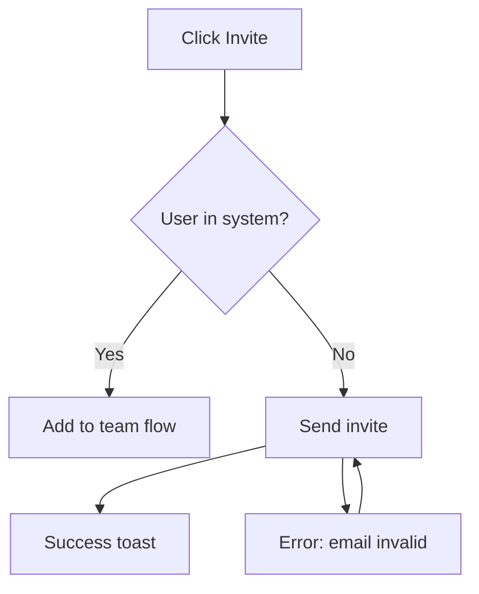
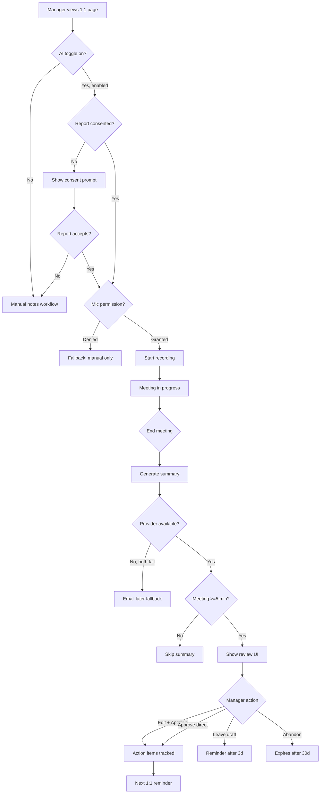

# User Flow

> **Category:** UX  ·  **Slug:** `user-flow`

## When to Use

- For every non-trivial multi-step flow in a PRD.
- Before design — flows align the team on happy path + edges.
- In specification — flows map to user stories.
- For onboarding / activation analysis — identify drop-off points.

## Input

| Field | Required | Description |
|-------|:--------:|-------------|
| User story / PRD | ✅ | What the flow should accomplish |
| User persona | ✅ | For whom |
| Entry points | ✅ | Where the user enters the flow |
| Exit points | ✅ | Success vs abandon vs errors |
| Existing flow (if modification) | ⬚ | Current state reference |

## Data Sources

1. User interviews — how they do it now.
2. Product analytics — drop-off data for existing flows.
3. Support tickets — pain points.
4. Competitor flows — baseline expectations.

### Related Skills

| Skill | What we take | When to invoke |
|-------|-------------|----------------|
| `user-story` | Stories → flow segments | Parent concept |
| `acceptance-criteria` | AC — edge / error cases in flow | After flow |
| `design-brief` | Flow input for design | Before brief |
| `jtbd-canvas` | Job context for flow trigger | For understanding entry |

## Flow Types

1. **Task flow** — linear path (create account, submit form)
2. **Decision flow** — branching (onboarding based on role)
3. **Error flow** — what happens when things go wrong
4. **Recovery flow** — how user gets back on track

## User Flow Doc Structure

1. **Flow name + purpose**
2. **Actors** — who uses this flow
3. **Preconditions** — state required to enter
4. **Entry points** — how user arrives
5. **Happy path** — step-by-step
6. **Decision points** — branching
7. **Error states** — each failure mode
8. **Exit points** — success, abandon, fail
9. **Metrics** — what we'll measure

## Protocol

### Step 0 — Define Boundaries

- Entry: where user flow starts (signup CTA, navigation click, email link)
- Exit: where it ends (success state, error, abandonment)
- Preconditions: auth state, permissions, data state

### Step 1 — Happy Path (Sequential Steps)

Linear sequence from entry to successful exit. Steps — user-visible actions + system responses.

Notation:
- **→** sequential step
- **[Action]** user action
- **(System)** system response
- **{Data}** state change

Example:
```
[Click "Invite teammate"] → 
(Modal opens with email field) →
[Type email + assign role] →
[Click "Send invite"] →
{Invite record created} →
(Email sent to recipient) →
(Success toast: «Invite sent») →
Exit: invitation pending
```

### Step 2 — Decision Points

Where flow branches based on:
- User input (role selection, plan choice)
- System state (feature availability, quota)
- Data (existing user vs new, permissions)

Diagram: use if/else or case statements:

```
After [Enter email]:
  IF email is existing user:
    → Step: Existing user flow (add to team)
  ELIF email domain blocked by policy:
    → Error: «Domain not allowed by your org»
  ELSE:
    → Continue: Invite new user flow
```

### Step 3 — Error States

For each system failure mode:
- **Trigger** — what causes it
- **User-visible message** — exact copy
- **Recovery action** — what user can do
- **System state** — logged? retryable?

Common errors:
- Network failure
- Validation failure
- Permission denied
- Quota exceeded
- 3rd party integration down
- Stale data / concurrent modification

### Step 4 — Empty / Loading States

- **Empty state:** first-time user, no data yet. What do they see?
- **Loading state:** what during network calls?
- **Partial state:** some data loaded, some loading?

### Step 5 — Exit Points

Categorize all exits:
- **Success:** task completed
- **Intentional abandon:** user cancelled
- **Implicit abandon:** user left without action (session timeout, closed tab)
- **Failure:** hard error, unrecoverable

For each exit:
- What happens in system
- What user feels
- Can they re-enter flow?

### Step 6 — Metrics Instrumentation

Per flow step:
- **Event name** (e.g., `invite_modal_opened`, `invite_sent_success`)
- **Properties** (role, source, etc.)
- **Conversion funnel** — start to success rate
- **Drop-off per step**

This feeds into AARRR + success metrics.

### Step 7 — Visualization

Options:
- **ASCII diagram** (for text-based docs)
- **Mermaid** (GitHub renders inline)
- **Figma / Whimsical / Miro** (for presentations)

Mermaid example:


## Validation (Quality Gate)

- [ ] Entry + exit points are explicit
- [ ] Preconditions listed
- [ ] Happy path step-by-step
- [ ] ≥ 2 decision points (except trivially linear)
- [ ] ≥ 3 error states with recovery
- [ ] Empty / loading states covered
- [ ] All exits categorized (success / abandon / fail)
- [ ] Metric events defined per step
- [ ] Visualized (diagram)

## Handoff

The result is input for:
- **`design-brief`** → flow → screens needed
- **UX Designer** → wireframes per step
- **Engineering** → API design per action
- **Data Analyst** → instrumentation plan
- **QA** → test scenarios per flow

Format: user flow doc (markdown + Mermaid/diagram). Via `$handoff`.

## Anti-patterns

| Error | Why it's bad | How to do it right |
|-------|-------------|-------------------|
| Happy path only | Production is edges | ≥ 3 error states |
| No decision points | Linear ≠ reality | Explicit branching |
| No empty state | First-time users confused | Always cover empty |
| No metrics | Can't measure funnel | Events per step |
| Text walls without diagram | Hard to follow | Visualize |
| No recovery paths | Users stuck | Every error has recovery |

## Template

```markdown
# User Flow: [Name]

## Purpose
[What user accomplishes]

## Actors
[Primary user + any secondary]

## Preconditions
- Auth: [logged in as X]
- State: [data state required]

## Entry Points
1. [Source A]
2. [Source B]

## Happy Path
1. [Action] → (System response)
2. ...

## Decision Points
- After step X:
  - IF [condition] → [branch A]
  - ELSE → [branch B]

## Error States
| # | Trigger | Message | Recovery |
| 1 | Invalid email | «Email format invalid» | Re-enter |

## Empty / Loading States
- Empty: [state]
- Loading: [state]

## Exit Points
- Success: [end state]
- Abandon: [what happens]
- Fail: [what happens]

## Metrics
- Event: `flow_started` — when entering
- Event: `flow_step_X_completed` — per step
- Event: `flow_succeeded` — success exit
- Event: `flow_abandoned` — abandon exit
- Funnel: start → success conversion

## Diagram
[Mermaid or link to Figma]
```

## Worked Example — TeamFlow AI-Enabled 1:1 Full Flow

```markdown
# User Flow: AI-Enabled 1:1 (End-to-End)

## Purpose
Manager conducts 1:1 with AI assistance — from scheduling to reviewing AI-generated summary + action items. 
This covers Stories S1, S2, S3, S4, S5 end-to-end.

## Actors
- **Primary:** People Manager (end-user, 5-15 direct reports)
- **Secondary:** Direct Report (sees AI consent prompt, may view shared summary)
- **Tertiary:** Admin (sets org-wide policy, affects defaults)

## Preconditions
- **Auth:** Manager logged into TeamFlow, on Team Tier account
- **State:** Manager has upcoming 1:1 scheduled, AI feature enabled at org level
- **Data:** Report has TeamFlow account + consented to AI recording (one-time org-level or per-meeting)
- **Browser:** Chrome/Edge/Safari/Firefox supporting MediaRecorder API

## Entry Points
1. Click on 1:1 in TeamFlow calendar view → meeting details page
2. Email reminder «Your 1:1 with Sarah starts in 10 min» → click link
3. Slack integration notification (if enabled by user)

## Happy Path

### Before meeting (pre-start)
```
1. [Manager views 1:1 meeting page] 
   → (Page shows meeting info + attendees + previous summary)
   
2. [Manager toggles "Use AI this meeting" ON]
   → {State: ai_enabled = true, saved to meeting record}
   → (Confirmation toast: "AI will generate summary after meeting ends")

3. [Manager clicks "Start meeting"]
   → (System prompts for microphone permission if not granted)
   → (Once granted: recording starts + AI transcription begins)
   → {Event: meeting_started with ai_enabled=true}
```

### During meeting
```
4. [Manager + Report converse normally]
   → (UI shows: recording indicator, duration timer, «AI is listening» subtle banner)
   → (Transcription accumulates in memory, not visible to user)
   → (Report sees same indicators through own TeamFlow session)

5. Optional: [Manager clicks "pause AI" for sensitive topic]
   → {Transcription suspended}
   → (UI shows: «AI paused — resume when ready»)
   → After 30 sec or resume click → transcription resumes

6. [Manager adds manual notes (optional) in parallel text area]
   → {Manual notes saved separately from AI transcript}
```

### End of meeting
```
7. [Manager clicks "End meeting"]
   → {Event: meeting_ended with duration, manual_notes_length}
   → (Modal: "AI is generating summary — you can close this or stay to review")
   
8. [System generates summary via LLM API]
   → {Latency target: <60s p95}
   → (Streaming UI: sections populate as generated)
   → {Event: ai_summary_generated, ai_provider, latency, confidence_avg}

9. [Manager sees summary review interface]
   → (Sections visible: Topics discussed, Decisions, Action items with confidence indicators)
   → (Auto-save of draft state)
```

### Review phase
```
10. [Manager reviews summary content]
    → (Can read, optionally scroll, decide to edit or approve)

11A. [Manager is satisfied → clicks "Approve"] 
     → (Confirmation modal: "Approve summary? Action items will be tracked.")
     → [Manager confirms]
     → {Event: ai_summary_approved, time_to_approve}
     → (Summary moves to «Approved», action items flow to tracking queue)
     → (Redirect to 1:1 history view)

11B. [Manager wants edits → enters edit mode]
     → (Inline editor enabled for each section)
     → {State: editing_mode = true}
     → ...continue to Scenario Edit
```

## Decision Points

```
After Step 2 (AI toggle):
  IF org policy "AI disabled" → toggle greyed out, tooltip «Contact admin»
  ELIF report not consented → show consent prompt before manager can enable
  ELIF first-time user → show quick onboarding tooltip

After Step 3 (start meeting):
  IF microphone permission denied → fallback to manual-notes-only mode, AI disabled for meeting
  ELIF audio stream fails mid-meeting → retry, if second fail → warn manager, continue without AI

After Step 8 (summary generation):
  IF LLM primary provider fails → failover to secondary (Anthropic) — transparent
  ELIF both providers fail → show fallback «AI summary unavailable — we'll email when ready»
  ELIF meeting duration <5 min → skip summary generation, show «Meeting too short» message

After Step 10 (review):
  IF manager idle >7 days without action → email reminder «Don't forget to review»
  IF manager never reviews → auto-mark draft as "unreviewed" after 30 days (not auto-approve)
```

## Error States

| # | Trigger | User-visible message | Recovery Action | System State |
|---|---------|----------------------|-----------------|--------------|
| 1 | Microphone permission denied | "AI needs microphone access — click here to allow, or continue without AI" | Re-request permission OR fallback to manual notes | Event `permission_denied` logged |
| 2 | Audio stream interrupted >30s | Banner: "Audio connection lost. Reconnecting…" | Auto-retry 3× in 30s intervals; if still failing, end AI recording gracefully | Event `audio_stream_lost` |
| 3 | LLM provider down | "Summary is taking longer than usual — we'll email you when ready (within 24h)" | Background job retries; email notification on success | Event `ai_summary_timeout_fallback` |
| 4 | Both LLM providers down | "AI summary unavailable right now. Your manual notes are preserved." | Email within 24h when recovered: «Want to retry?» | Event `ai_summary_unavailable` |
| 5 | Report revoked consent mid-meeting | "Sarah turned off AI recording. Switching to manual notes." | AI stops; manual notes mode continues | Event `ai_declined_by_participant` |
| 6 | Summary quality low confidence | Warning banner: «This summary had low confidence — review carefully before approving» | User reviews carefully, or requests regeneration (once) | Event `ai_summary_low_confidence` |

## Empty States

- **First-time user, no previous 1:1s:** Show onboarding tour (3 tooltips: what AI does, how to enable, how to review)
- **No action items extracted:** "No action items identified" with explanatory tooltip «You can add manually»
- **No summary sections populated:** «Meeting was very short — manual notes preserved, no AI summary» (skipped if <5 min)

## Loading States

- **Step 3 (starting recording):** Button state: "Starting…" → disabled → "Recording" (red dot indicator)
- **Step 8 (summary generation):** 
  - 0-5s: No indicator (feels instant)
  - 5-30s: Progress bar appears («Generating summary…»)
  - 30-60s: Section-by-section streaming (topics first, action items last typically)
  - 60s+: Switch to async mode («Taking longer — we'll email you»)
- **Step 10 (editor loading):** Skeleton screen with placeholder text in ~300ms

## Exit Points

### Success exits
- **Approved summary** (Step 11A): redirects to 1:1 history view with green toast
- **Saved draft and left** (Step 11B interrupt): state preserved, resumed via notification

### Abandon exits  
- **Closed meeting modal before summary ready** (Step 7-8): summary generates in background, user receives notification
- **Left review without approving**: draft preserved; email reminder after 3 days

### Fail exits
- **AI unavailable, fallback to manual** (error 4): user continues with manual notes workflow; meeting still counts
- **Mic permission denied fallback** (error 1): manual notes only; no AI artifacts created

## Metrics Instrumentation

### Events per step
- `ai_toggle_enabled` — Step 2: properties `{meeting_id, user_id, org_policy}`
- `meeting_started` — Step 3: `{ai_enabled, mic_permission_status}`
- `meeting_ended` — Step 7: `{duration, manual_notes_chars, participants_count}`
- `ai_summary_generated` — Step 8: `{latency, provider, confidence_avg, summary_length}`
- `summary_review_opened` — Step 9: `{time_from_meeting_end}`
- `summary_edited` — Step 11B: `{sections_edited, char_delta, time_in_edit}`
- `summary_approved` — Step 11A: `{time_to_approve, edit_count}`

### Funnel metrics
```
Started AI meeting (Step 3)           100%
    │
    ▼
Summary generated (Step 8)              92%  (8% lost: mic denied, too short, stream fail)
    │
    ▼
Summary reviewed (Step 10, opened)     87%  (5% unreviewed after 7 days)
    │
    ▼
Summary approved (Step 11A)             78%  (9% left in draft, 82% of reviewed = approved)
```

### Quality metrics
- **Edit rate** = summaries edited / summaries reviewed (target: 30-50%)
- **Time-to-approve** = median time from generation to approval (target: ≤2 min)
- **Error rate** = failed summaries / total attempts (target: <2%)
- **P95 latency** = summary generation latency (target: ≤60s)

## Diagram (Mermaid)



> **user-flow lesson:** Comprehensive flow doc shows why **11 scenarios** exist in the AC for Story S2 — each decision point or error state is a scenario. Flow first, AC second — you can't write AC without understanding flow. **6 error states + 3 empty states + 3 loading states** for a single flow is normal for production B2B — users encounter edges more in the wild than you expect.
```
