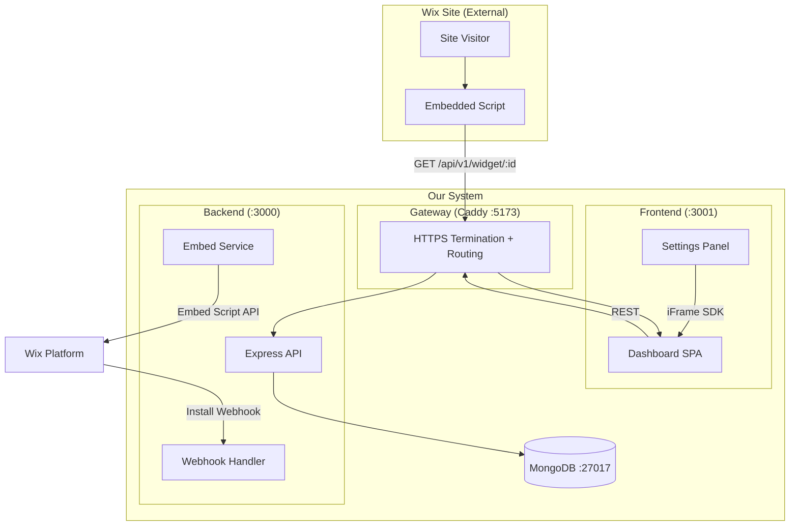

# Skill: Architecture Document

Full system architecture — from overview to implementation plan.

**Sections:**
1. [Inputs](#inputs)
2. [Document structure](#structure) (11 section)
3. [Examples for each section](#examples)
4. [Quality Checklist](#quality-checklist)
5. [Red Flags](#red-flags)

---

## Inputs

| Input | Mandatory | From |
|------|:---:|--------|
| PRD | ✅ | Product Manager gate |
| UX Spec | ✅ | UX/UI Designer gate |
| Current State Analysis | ⬜ optional | `$current_state_analysis` |
| System Design Checklist | ⬜ optional | `$system_design_checklist` |
| Stack/deploy constraints | ✅ | DevOps / team constraints |

---

## Document structure

### 1) Overview

```markdown
## 1. Overview

### What we're building
<1 paragraph: what we are building and what problem we are solving>

### Constraints
- Stack: React 18 + Vite (FE), Express 4 (BE), MongoDB 7 (DB)
- Deployment: Docker Compose + Caddy
- Integration: Wix Self-Hosted App (iFrame SDK)
- Timeline: 2 sprints (4 weeks)

### Assumptions
- Wix handles user authentication (app is installed per-site)
- Single MongoDB instance sufficient for MVP (< 10K installations)
- Dashboard used by site owners only (low concurrency)
```

---

### 2) System Context

```markdown
## 2. System Context

### Actors
| Actor | Type | Interaction |
|-------|------|-------------|
| Site Owner | Human | Dashboard: manages settings, coupons |
| Site Visitor | Human | Storefront: sees popup, uses coupon |
| Wix Platform | System | Install/uninstall webhooks, OAuth |

### External Integrations
| System | Protocol | Purpose |
|--------|----------|---------|
| Wix REST API | HTTPS | Embed script, OAuth tokens |
| Wix iFrame SDK | JS SDK | Settings Panel ↔ Widget communication |

### System Boundary
Dashboard + API + Embedded Script = our system.
Wix Platform + Site Visitor's Browser = external.
```

---

### 3) High-level Architecture Diagram



---

### 4) Modules / Components

For each module fill in:

```markdown
## 4. Modules

### 4.1 API Server (Express)

| Aspect | Description |
|--------|---------|
| **Responsibility** | REST API, webhook handling, OAuth, embed script |
| **NOT responsible for** | UI rendering, static files serving (Caddy does this) |
| **Public API** | See API Contracts doc |
| **Dependencies** | MongoDB (via Mongoose), Wix REST API |
| **Layers** | Router → Controller → Service → Repository |
| **Test boundary** | Unit: services (mock repos). Integration: repos + DB |

### 4.2 Dashboard (React SPA)

| Aspect | Description |
|--------|---------|
| **Responsibility** | Settings management, coupon CRUD, live preview |
| **NOT responsible for** | Direct DB access, Wix API calls |
| **Public API** | N/A (user-facing UI) |
| **Dependencies** | API Server (REST), Wix iFrame SDK (Settings Panel) |
| **State** | Zustand (settings store, coupon store) |
| **Test boundary** | Unit: stores, utils. Integration: component render tests |

### 4.3 Embedded Script

| Aspect | Description |
|--------|---------|
| **Responsibility** | Fetch config from API, render popup/launcher on Wix site |
| **NOT responsible for** | Settings management, data persistence |
| **Dependencies** | API Server (GET /widget/:id) |
| **Test boundary** | Unit: render logic. E2E: browser test on Wix site |
```

---

### 5) Flow Mapping

Mapping UX flow → technical path:

```markdown
## 5. Flow Mapping

### Flow: Site Owner saves settings

| Step | UX | Frontend | API | Service | Repository | DB |
|------|-----|---------|-----|---------|------------|-----|
| 1 | Click "Save" | `PUT /api/v1/settings/:id` | `settingsRouter` | `settingsService.update()` | `settingsRepo.upsert()` | `settings.updateOne()` |
| 2 | See "Saved!" toast | Response 200 → toast | — | — | — | — |
| 3 | Live Preview updates | Re-fetch config | — | — | — | — |

**States:**
- Loading: spinner on Save button
- Error: toast "Failed to save" + retry
- Success: toast "Settings saved" + preview refresh

### Flow: Visitor sees popup on Wix site

| Step | UX | Embedded Script | API | DB |
|------|-----|----------------|-----|-----|
| 1 | Page loads | `embedded-script.js` bootstrap | — | — |
| 2 | — | `GET /api/v1/widget/:id` | `widgetController` | `settings.findOne()` + `coupons.findOne()` |
| 3 | Popup appears | `renderWidget(config)` | — | — |
| 4 | Click CTA | Copy coupon code | — | — |
```

---

### 6) Integration Patterns

```markdown
## 6. Integration Patterns

| Integration | Pattern | Timeout | Retry | Idempotent |
|------------|---------|---------|-------|------------|
| Wix Install Webhook | Async POST → process | 10s | No (Wix retries) | Yes (upsert) |
| Wix Embed Script API | Sync POST | 5s | 2x with backoff | Yes |
| Widget Config Fetch | Sync GET | 3s | No (fail gracefully) | N/A (read) |
| Dashboard REST | Sync CRUD | 5s | No (user retries) | PUT = idempotent |
```

---

### 7) Error Handling Strategy

```markdown
## 7. Error Handling

### Error format (API response)
\`\`\`json
{
  "error": {
    "code": "VALIDATION_ERROR",
    "message": "Invalid coupon code",
    "details": [{ "field": "code", "message": "Must be 3-20 chars" }]
  }
}
\`\`\`

### Mapping
| Domain Error | HTTP | Code | UI Message | Log |
|-------------|------|------|-----------|-----|
| Validation | 400 | VALIDATION_ERROR | Field-level errors | warn |
| Not Found | 404 | NOT_FOUND | "Not found" | info |
| Duplicate | 409 | DUPLICATE | "Already exists" | warn |
| Auth | 401 | UNAUTHORIZED | "Please log in" | warn |
| Forbidden | 403 | FORBIDDEN | "Access denied" | warn |
| Internal | 500 | INTERNAL_ERROR | "Something went wrong" | error |

### Rule: never expose
- Stack traces
- DB error messages
- Internal paths
- Secret values
```

---

### 8) Testing Strategy

```markdown
## 8. Testing Strategy

| Layer | What | Tool | Mock |
|-------|------|------|------|
| Unit | Services, utils, validators | Vitest | Repos, external APIs |
| Integration | API endpoints, DB queries | Vitest + MongoMemoryServer | External APIs |
| Component | React components | Vitest + RTL | API calls (msw) |
| E2E | Critical flows | Browser agent / Playwright | Nothing |

### Must-have scenarios
- [ ] CRUD settings (happy path + validation errors)
- [ ] CRUD coupons (happy path + duplicate)
- [ ] Widget endpoint returns correct payload
- [ ] Install webhook creates installation + settings
- [ ] Embedded script renders from API payload
```

---

### 9) Scalability Bottlenecks

```markdown
## 9. Scalability Bottlenecks

| Bottleneck | Current | When it hurts | Mitigation |
|-----------|---------|---------------|------------|
| No DB indexes | Collection scan | > 1K docs | Add compound indexes |
| Widget fetch on every pageview | API load | > 100 rps | Cache-Control + CDN |
| Single MongoDB | Write throughput | > 10K writes/s | Replica set |
| Sync embed in webhook | Webhook timeout | Many installs | Background job |
| No connection pooling | Connection storms | > 50 concurrent | maxPoolSize config |
```

---

### 10) Growth Plan

```markdown
## 10. Growth Plan

| Scale | Architecture | Changes needed |
|-------|-------------|----------------|
| **< 1K installs** | Current: monolith + single Mongo | None |
| **1K – 10K** | Add indexes, connection pooling, cache | ARCH-xx |
| **10K – 100K** | Replica set, CDN for widget, Redis cache | ARCH-xx |
| **100K – 1M** | Separate API from webhook processing, queue | ARCH-xx |
| **> 1M** | Microservices, sharding, multi-region | Full redesign |
```

---

### 11) Implementation Plan

```markdown
## 11. Implementation Plan

### Phase 1: Foundation (Sprint 1)
| # | Task | Dependencies | Estimate |
|---|------|-------------|----------|
| 1 | DB schemas + migrations | None | 2h |
| 2 | API: CRUD settings | #1 | 4h |
| 3 | API: CRUD coupons | #1 | 4h |
| 4 | API: Widget endpoint | #1 | 2h |
| 5 | Webhook handler | #1 | 3h |

### Phase 2: Frontend (Sprint 1-2)
| # | Task | Dependencies | Estimate |
|---|------|-------------|----------|
| 6 | Dashboard: Settings page | #2 | 6h |
| 7 | Dashboard: Coupon management | #3 | 4h |
| 8 | Dashboard: Live Preview | #4, #6 | 4h |

### Phase 3: Integration (Sprint 2)
| # | Task | Dependencies | Estimate |
|---|------|-------------|----------|
| 9 | Embedded Script | #4 | 6h |
| 10 | Wix embed integration | #5, #9 | 3h |
| 11 | E2E testing | All | 4h |

### Dependency graph
\`\`\`
#1 → #2 → #6
#1 → #3 → #7
#1 → #4 → #8, #9
#1 → #5 → #10
#6 + #4 → #8
#9 + #5 → #10
All → #11
\`\`\`
```

---

## Quality Checklist

| # | Check | Status |
|---|-------|--------|
| 1 | Any UX flow is traced via modules → API → DB | ☐ |
| 2 | Module boundaries reduce coupling (no circular deps) | ☐ |
| 3 | Testability is built in (mock boundaries defined) | ☐ |
| 4 | Error handling is uniform (format + mapping) | ☐ |
| 5 | Observability is planned (logs, health checks) | ☐ |
| 6 | Deployment strategy is defined | ☐ |
| 7 | There is a growth plan (although would 3 thresholds) | ☐ |
| 8 | Implementation plan with dependencies | ☐ |

---

## Red Flags

| Flag | Description | Detection |
|------|---------|-------------|
| Big Ball of Mud | No clear architecture | No layer separation |
| Golden Hammer | One decision for all tasks | "MongoDB for everything" |
| Premature Optimization | Optimization without data | Cache/sharding before the first user |
| Not Invented Here | Refusal of ready-made solutions | Custom auth, custom ORM |
| Analysis Paralysis | Endless planning | 3+ alternatives without decisions |
| Magic | Non-obvious behavior | Hooks with business logic |
| Tight Coupling | High coupling | Changing one module breaks others |
| God Object | One component does everything | File > 500 lines |

---

## Deliverables

| Artifact | Format | Where to store |
|---------|--------|---------------|
| Architecture Document | Markdown (11 sections above) | `docs/architecture/architecture.md` |
| Architecture Diagram | Mermaid in the document | inline |
| ADR records | `$adr_log` format | `docs/architecture/adr/` |

---

## See also
- `$current_state_analysis` — audit before the new architecture
- `$system_design_checklist` — quick completeness check
- `$adr_log` — recording decisions
- `$api_contracts` — detail API contracts
- `$data_model` — detailed data model