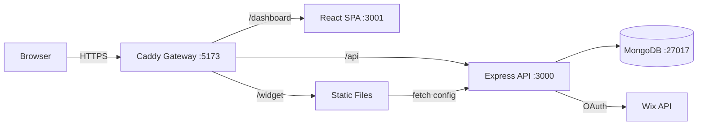

# Skill: System Design Checklist

Self-check of architecture completeness before handing off to development.

**Sections:**
1. [Functional Requirements](#1-functional-requirements)
2. [Non-Functional Requirements](#2-nfr)
3. [Technical Design](#3-technical-design)
4. [Data Layer](#4-data-layer)
5. [Security](#5-security)
6. [Operations](#6-operations)
7. [Red Flags](#7-red-flags)
8. [Output Template](#8-output)

---

## 1. Functional Requirements

| # | Check | Guidance | Status |
|---|-------|---------|--------|
| 1.1 | User stories documented | Format: "As a [user], I want [action], so that [value]". Minimum for MVP scope | ☐ |
| 1.2 | UI/UX flows mapped | Each screen → actions → outcomes. Including loading/error/empty states | ☐ |
| 1.3 | API contracts defined | Endpoints, methods, request/response schemas, status codes. Format: OpenAPI or markdown table | ☐ |
| 1.4 | Data models defined | Entities, relationships, constraints. Format: ER diagram (mermaid) or schema definitions | ☐ |
| 1.5 | Edge cases covered | What if: empty data, concurrent updates, partial failures, expired tokens | ☐ |

### PASS Example

```
1.3 API contracts: ✅ PASS
  POST /api/v1/products — CreateProductRequest → ProductResponse (201)
  GET /api/v1/products/:id — → ProductResponse (200) | ErrorResponse (404)
  Schemas defined in docs/api-contracts.md
```

### MISSING Example

```
1.5 Edge cases: ❌ MISSING
  Behavior not defined for:
  - Concurrent update settings (optimistic locking?)
  - Expired item on storefront (show expired or hide?)
  → Recommendation: add acceptance criteria to PRD
  → Task: ARCH-05
```

---

## 2. Non-Functional Requirements

| # | Check | Guidance | Status |
|---|-------|---------|--------|
| 2.1 | Performance targets | p95 latency ≤ X ms, throughput ≥ Y rps. For each critical endpoint | ☐ |
| 2.2 | Scalability | Expected load (users, requests, data volume). Growth plan (x10, x100) | ☐ |
| 2.3 | Availability | Uptime target (99.9%?). Acceptable downtime. Graceful degradation strategy | ☐ |
| 2.4 | Security | Auth/authz model, data classification, compliance requirements (GDPR, PCI) | ☐ |
| 2.5 | Observability | Logging, metrics, alerting, tracing requirements | ☐ |

### Guidance: Performance targets

```markdown
## Performance Targets

| Endpoint | p50 | p95 | p99 | Max concurrent |
|----------|-----|-----|-----|----------------|
| GET /api/v1/widget/:id | 50ms | 100ms | 200ms | 100 |
| POST /api/v1/settings | 100ms | 200ms | 500ms | 20 |
| Dashboard page load | 1s | 2s | 3s | 50 |

Measurement: response time from gateway, excluding network latency.
```

---

## 3. Technical Design

| # | Check | Guidance | Status |
|---|-------|---------|--------|
| 3.1 | Architecture diagram | Text-based (mermaid/ASCII). Shows: components, data flows, boundaries | ☐ |
| 3.2 | Component responsibilities | For each: what it does, what it does NOT do, public API, dependencies | ☐ |
| 3.3 | Data flow | Request path: client → gateway → API → service → repo → DB → response | ☐ |
| 3.4 | Integration points | External systems (Wix API, payment, email). Retry/timeout/circuit breaker strategy | ☐ |
| 3.5 | Error handling | Unified error format. Mapping: domain errors → HTTP codes → UI messages | ☐ |
| 3.6 | Testing strategy | Unit/integration/e2e boundaries. Coverage targets. What to mock | ☐ |

### Example: Architecture diagram (mermaid)



### Example: Error handling table

| Domain Error | HTTP Code | UI Message | Log Level |
|-------------|-----------|-----------|-----------|
| ValidationError | 400 | "Check your input" + field details | warn |
| NotFoundError | 404 | "Not found" | info |
| DuplicateError | 409 | "Already exists" | warn |
| AuthError | 401 | "Please log in" | warn |
| InternalError | 500 | "Something went wrong" | error |

---

## 4. Data Layer

| # | Check | Guidance | Status |
|---|-------|---------|--------|
| 4.1 | Schema definitions | Mongoose schemas with validators, defaults, timestamps | ☐ |
| 4.2 | Embed vs Reference | Conscious choice, documented in ADR | ☐ |
| 4.3 | Indexes | Compound indexes for key query patterns. Verified via explain() | ☐ |
| 4.4 | Pagination | Cursor for large collections, skip for small ones | ☐ |
| 4.5 | Migrations | migrate-mongo or equivalent. Backfill strategy for schema changes | ☐ |

---

## 5. Security

| # | Check | Guidance | Status |
|---|-------|---------|--------|
| 5.1 | Input validation | Zod schemas on every endpoint. Whitelist approach | ☐ |
| 5.2 | Auth/Authz | JWT/session strategy. Authorization before data access | ☐ |
| 5.3 | Secrets management | Env vars only. .env.example without values. gitignore | ☐ |
| 5.4 | Secure headers | Helmet, CORS whitelist, CSP | ☐ |
| 5.5 | Dependency audit | `npm audit`, lockfile committed, no known vulnerabilities | ☐ |

---

## 6. Operations

| # | Check | Guidance | Status |
|---|-------|---------|--------|
| 6.1 | Deployment | Docker Compose / K8s. Build → test → deploy pipeline | ☐ |
| 6.2 | Health checks | `/health/live` + `/health/ready` endpoints | ☐ |
| 6.3 | Monitoring | Structured logs (pino). Key metrics: latency, error rate, throughput | ☐ |
| 6.4 | Alerting | Error rate > X% → alert. p95 latency > Yms → alert | ☐ |
| 6.5 | Backup/Recovery | DB backup strategy. RPO/RTO defined | ☐ |
| 6.6 | Rollback plan | How to rollback: previous Docker image, DB migration down, feature flag | ☐ |

---

## 7. Red Flags

| # | Flag | What it is | How to detect |
|---|------|---------|---------------|
| 7.1 | Big Ball of Mud | No clear architecture, everything is connected to everything | No layers, circular deps |
| 7.2 | God Object | One file/class does everything | File > 500 lines, > 10 methods |
| 7.3 | Tight Coupling | Changing one module breaks others | No interfaces/contracts between layers |
| 7.4 | Magic | Unobvious behavior without documentation | Mongoose hooks with business logic, implicit globals |
| 7.5 | Analysis Paralysis | Endless planning | No MVP path, 3+ alternatives without decision |
| 7.6 | Premature Optimization | Optimization without data | Cache/sharding before the first user |
| 7.7 | Not Invented Here | Rejection of standard solutions | Custom auth, custom ORM, custom logger |

---

## 8. Output

```markdown
# System Design Checklist: <feature/project>

**Date:** YYYY-MM-DD
**Reviewer:** Architect Agent

## Results

| Section | Pass | Missing | Total |
|---------|------|---------|-------|
| Functional | 4 | 1 | 5 |
| NFR | 3 | 2 | 5 |
| Technical | 5 | 1 | 6 |
| Data | 4 | 1 | 5 |
| Security | 5 | 0 | 5 |
| Operations | 4 | 2 | 6 |
| Red Flags | 6 | 1 | 7 |
| **Total** | **31** | **8** | **39** |

## Missing Items

| # | Check | Severity | Recommendation | Task |
|---|-------|----------|----------------|------|
| 2.1 | Performance targets | 🟠 P1 | Define p95 targets for critical endpoints | ARCH-12 |
| 6.4 | Alerting | 🟡 P2 | Set up basic alerts after MVP | ARCH-15 |

## Verdict
✅ READY for development (with noted ARCH-xx items tracked)
⚠️ CONDITIONAL — must address P0/P1 items before dev
❌ NOT READY — significant gaps in <section>
```

---

## See also
- `$current_state_analysis` — current state audit (before this checklist)
- `$architecture_doc` — full Architecture Document (after checklist)
- `$adr_log` — recording decisions
- `$security_baseline_dev` — detailed security check
